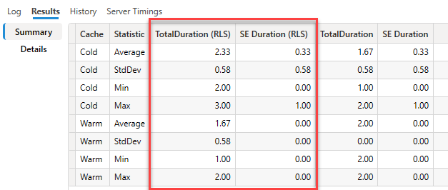

# DAX Studio version 3.0

Today we are happy to announce the release of version 3 of DAX Studio

## Dark Mode!

This has been an outstanding request for a long time and finally we are happy to announce that we now support Dark Mode! You can switch between the 3 different mode settings using the button at the top of the ribbon

*  Auto-detect - attempts to set the appropriate mode based off the preferences in the Operating System (should work for Windows 10 or higher)
*  Light mode
*  Dark mode

## A clean, modern User Interface

With the help of the amazing Daniele at SQLBI we now have a clean, modern update to the user interface including new icons and visual styling

A couple of important changes worth noting are:
* document tabs have been moved to the bottom
* Metadata, Functions and DMV tabs have been moved to the top of their area
* the tabs for Results, Logs, Traces have been move to the top of their area

## New Ribbon options

In addition to being able to collapse the ribbon there is now also an option to show a simplified view

This view takes up less vertical space while still keeping the most commonly used features easily accessible.

## Tracing Improvements

The internal tracing engine has been re-architected internally which will make it easier to add new trace types in future and it should also have fixed the issue where sometimes the trace data would 

In addition the following enhancements have been made to the existing traces:

### Server Timings - Waterfall column

A "waterfall" column has now been added to the Server Timings tab. This gives you a quick visual indication of which Storage Engine queries took the longest and where they

### Query Plan - child operation indicator

The Query Plan trace will now show a dashed line to indicate operations that are children of the currently selected row. This 

### All Queries

The All Queries trace can now be run in parallel with other trace types. You used to have to either stop other traces or run them in a different document, but now all the different traces can be run at the same time if you need to. 

:::info
Just take note that traces do add some extra load to the Tabular Engine, so it's a good idea to stop them when you have finished collecting the data you needed.
:::

## View As

A new **View As** option has been added in the **Advanced** tab to enable easy testing of RLS roles

This enables for both testing the functionality of the selected role to make sure queries return the correctly filtered data and you can run Server Timings traces to measure the impact of these roles on your queries.

When it is active the **View As** option shows a yellow information bar at the top of the query editor. You can exit out of the **View As** mode by clicking on the X in the right hand side of the information bar

To make performance comparisons even easier a new option has been added to the Benchmark feature which is enabled when you start the benchmark while you have **View As** active.

When you tick the option to do a second pass the benchmark results will include a second set of columns in the results for those passes where the RLS role was active

# Other Updates / Fixes

The following lists other minor fixes and improvements that have been added since the previous release

## Updates
* [#826](https://github.com/daxstudio/daxstudio/issues/826) added PowerPivot model detection timeout in options
* Updating syntax highlighting to handle multi-line strings
* Added highlighting of cache nodes in physical query plans
* Improved state tracking for trace windows
* Prevented interleaving of clearcache with query execution
* Width of the connection dialog has been increased 

## Fixes
* Fixed [#764](https://github.com/daxstudio/daxstudio/issues/764) error when running from cmd prompt
* Fixed [#799](https://github.com/daxstudio/daxstudio/issues/799) error when opening querybuilder files from older versions
* Fixed [#812](https://github.com/daxstudio/daxstudio/issues/812) using FIPS compliant hash
* Fixed [#816](https://github.com/daxstudio/daxstudio/issues/816) database dropdown too small
* Fixed [#838](https://github.com/daxstudio/daxstudio/issues/838) added support for custom datetime formats when exporting to xlsx
* Fixed [#841](https://github.com/daxstudio/daxstudio/issues/841) allowed for loading of performance data where component information was missing
