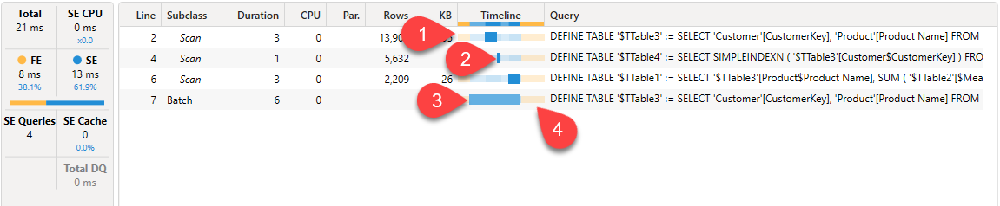
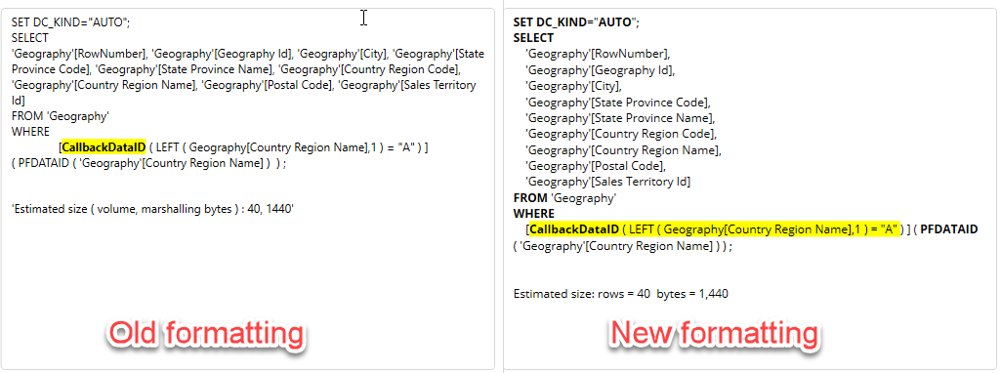
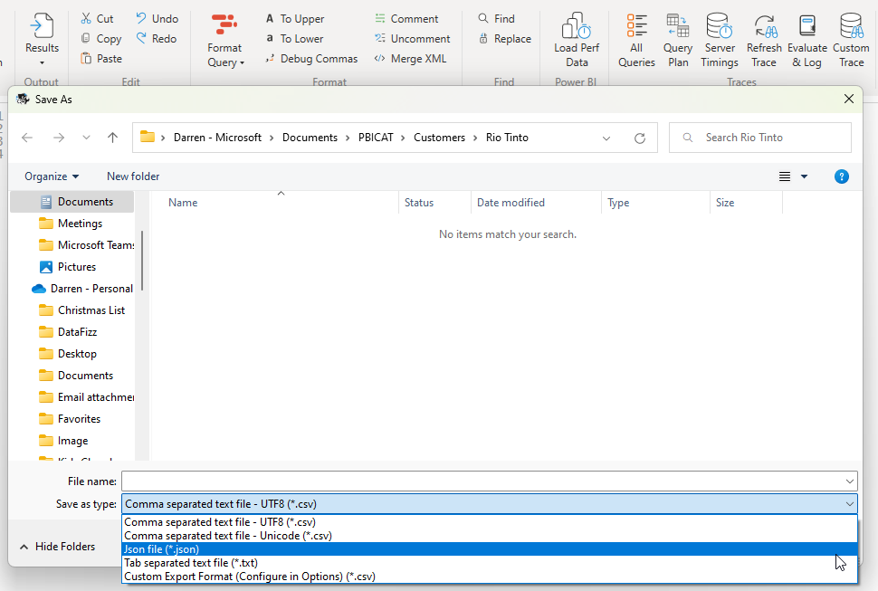
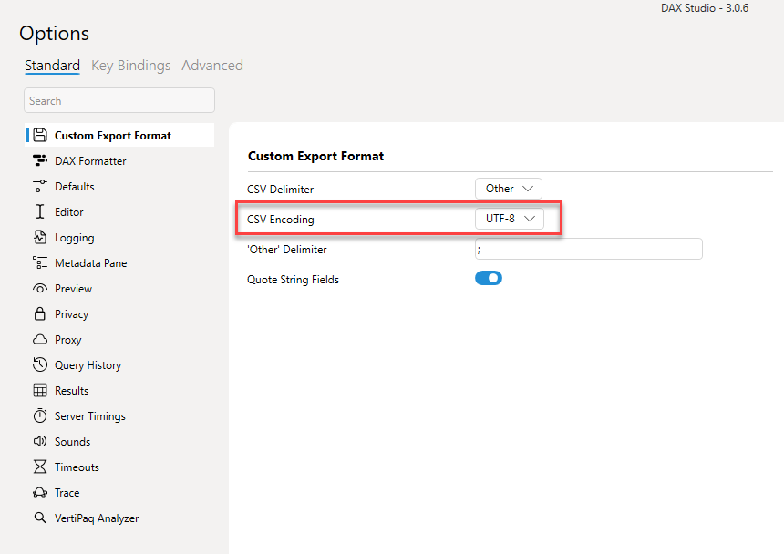
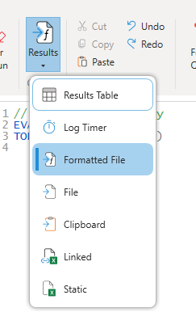
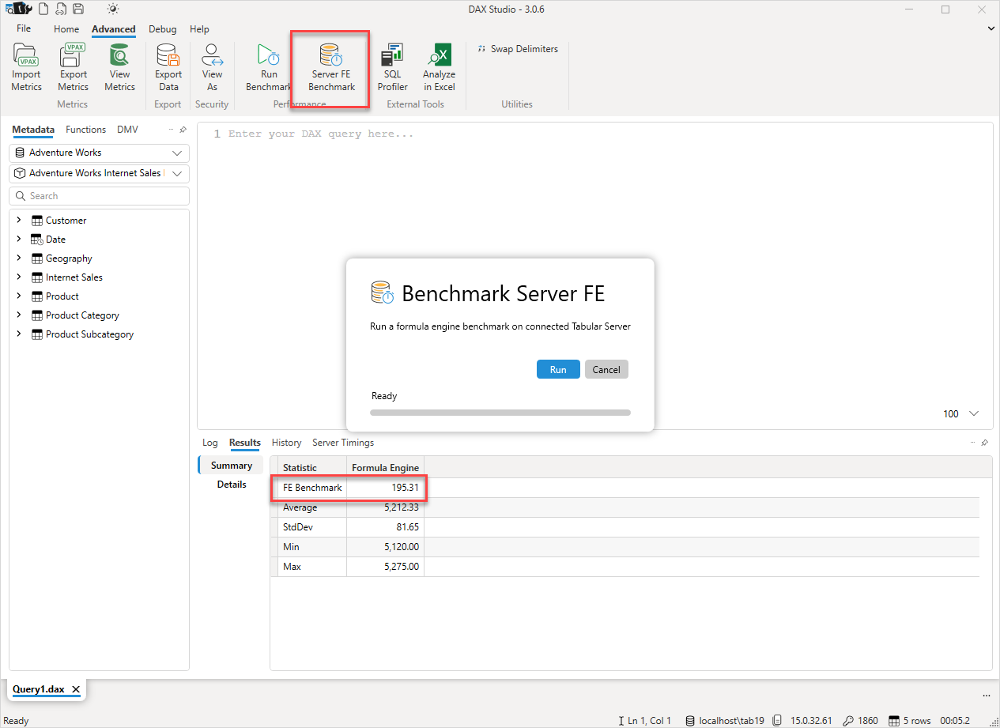

import Issue from '@site/src/components/GithubIssue';

# DAX Studio version 3.0.6

Today we are happy to announce the release of version 3.0.6 of DAX Studio

## Updated Timeline/Waterfall visualization in Server Timings
The old Waterfall column has been replaced by the new Timeline column. This column contains the same information as the old waterfall column, but includes a new background image to help visualise times during the execution of a query when either the formula engine (denoted by yellow sections) or the storage engine (denoted by blue sections) was active.

Below is an annotated example of the new **Timeline** column.

1. You can see at the start of this query that there is a block of yellow Formula Engine work taking place
1. Then each of the Storage Engine scans are represented by a thicker blue rectangle
1. Any batch events are represented by a lighter blue rectangle. You can see in this example that 3 preceeding scans are part of the batch
1. Finally we can see that the query has a block of Formula engine work at the end of the query

:::info
Note that the time that is allocated to the Formula Engine (denoted by the yellow portions of the Timeline) are simply those times during the query when no Storage Engine events were taking place. We do not have separate events for the formula engine activity. 
:::

## xmSQL / DirectQuery formatting improvements
The formatting of the xmSQL code in the Server Timings pane has been improved to include key word highlighting and improved line breaks to make the code easier to read

## New output options
There are a number of improvements to the output options in this release of DAX Studio

### New .json file Output option
When outputting to a file you now have the option to output to a json format. This output produces the same format as the Power BI [ExecuteQueries](https://learn.microsoft.com/en-us/rest/api/power-bi/datasets/execute-queries) REST API

### Custom CSV encoding
When using the custom csv format you can now choose between utf-8 or unicode encoding

### Formatted File output
There is now a "Formatted File" output option. The standard "File" output is the recommended one as it outputs your data with full precision, decimal numbers are output without any rounding and datetimes are output using a standard ISO 8601 format. However if you require a csv output which uses the same formatting that gets applied to the grid output then this new "Formatted File" option gives you that. Just be aware that if you are transferring these files between machines that you may have issues with datetime data if your regional settings are different between the machines.

## FE Benchmarks (Preview)

:::tip
This feature is not visible by default you need to turn it on in the Options - Preview settings
:::

The FE Benchmark feature runs a standard formula engine only query against the current data source. It produces a FE Benchmark number that should help in estimating the expected performance in production.

If your laptop runs a query in 2 seconds and it's index is 200, then if you run the same query on a server that has an index 100 we should expect roughly 4 seconds ie. the query will take twice as long since the benchmark score was half.

This option is currently in preview so that we can start testing this across a wider range of real world scenarios. There are a lot of other factors that can influence query performance such concurrent load, CPU cache size and type and the memory and memory bus speeds to name a few. So we may need to look at adjusting this as we gather more real information.

---

## All new Features & Fixes
_Below is the full list of all the new features and fixes._

### New Features
* <Issue id="861"/> adding SHA256 hashes for downloads
* <Issue id="866"/> added copy with/without headers option for query results
* <Issue id="973"/> Added Duplicate option to tab right-click menu
* <Issue id="1016"/> open a .dax file by dragging it onto DAX Studio
* <Issue id="1031"/> adding encoding option for custom CSV output
* <Issue id="1051"/> added Formatted File as an output option
* added json option when outputting to a file
* FE Benchmarks
* Updated Timeline/Waterfall visualization in Server Timings
* xmSQL / DirectQuery formatting improvements
* moved preview and vertipaq analyzer settings from the advanced to the standard options page

### Fixes
* <Issue id="1062"/> fix vertipaq analyzer showing &gt;unknown&lt; in summary pane for AAS / PBIP
* <Issue id="1060"/> enabling Shift+Enter to be used as a custom hotkey
* <Issue id="1052"/> disabled re-ordering of columns in vertipaq analyzer
* <Issue id="1036"/> fix location of desktop shortcut file for Current User installs
* <Issue id="1030"/> QueryBuilder measures missing table references when loading from file
* <Issue id="1029"/> QueryBuilder IN filters not loading from file correctly
* <Issue id="1026"/> improving VertiPaq Analyzer tooltips
* <Issue id="1025"/> fixing spelling / capitalization errors
* <Issue id="968"/> Tool Window incorrectly docking
* <Issue id="967"/> permission error on non-admin install
* <Issue id="979"/> improved color contrast in dark mode
* <Issue id="994"/> adjusted measure icon position when vertical scrollbars are always displayed
* <Issue id="997"/> adding support for measure filters in Query Builder
* <Issue id="999"/> fixed display of columns with open parenthesis as first character
* <Issue id="951"/> moved Swap Delimiters / Debug Commas to advanced
* fixed metadata display for multi-dimensional models
* skip showing crash dialog if app is shutting down
* Improved generation of Define Measure and Define Dependent Measures
* Fixed crash in BindableFocusBehaviour and AutomationPeer
* fixed cell alignment in View Metrics Columns screen
* Fixed crash on update flag click event
* Fixed crash when browsing for a folder during CSV data export
* improvements for FE duration calculation
* added default file name when exporting bim from vpax
* fixed the hidden table icon
* fixed Excel tracing 
* fixed invalid button states after failed connection attempt