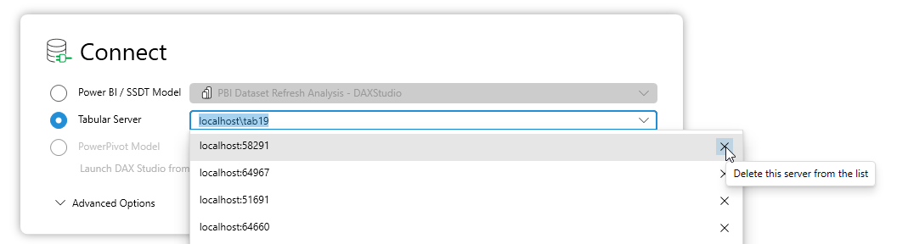
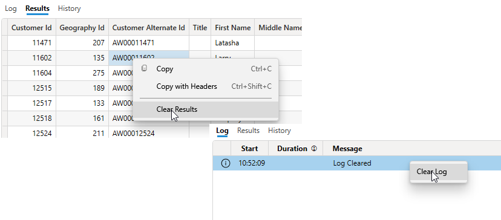
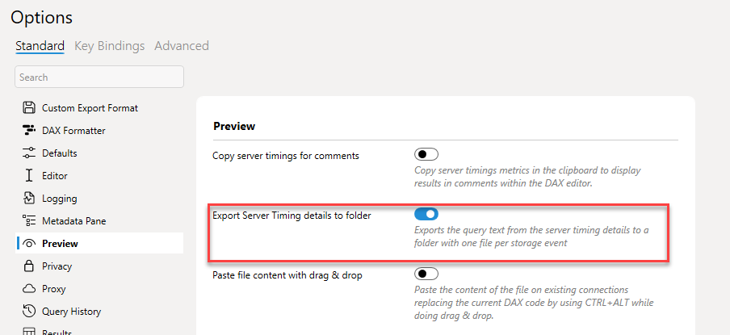

import Issue from '@site/src/components/Github-Issue';

# DAX Studio version 3.0.7

Today we are happy to announce the release of version 3.0.7 of DAX Studio

## Metadata loading improvements

DAX Studio uses an asynchronous, lazy loading strategy to populate the metadata which has worked reasonably well over the years, but we occassionaly see some strange errors due about reader objects being already in use (such as those in issue <Issue id="1076"/> ) or responses containing unexpected data. There are actually a number of small tweaks in the previous verion (3.0.6) which were meant to help avoid these issues, but there was also one minor improvement to the formatting of query results which made this worse.

This sort of issue was extremely hard to isolate because I rarely saw it myself and it was very hard to come up with consistent scenarios to reproduce the issue. And if you cannot reproduce an issue you can make changes, but you don't know if you've fixed the problem or if you've just been lucky. It turns out that with some help from some log files from users I was able to isolate and reproduce this issue and confirm that it was a multi-threading bug. 

Starting with this version we now internally use a separate connection object for metadata and running queries so this should prevent this issue entirely going forward.

## Delete entries from the recent server list

This is a small quality of life improvement where you can now delete entries from the recent server list from the connection dialog itself. This list should be self-maintaining as new entries are added at the top and old one should fall off the bottom over time. But if you have entries that are no longer valid and you want to clean up this list you now have an easy way to remove them.

## Clearing the Log and Results panes

There are now right-click options on the **Log** and **Results** panes to allow you to clear them.

## [Preview] Exporting Server Timings text to separate files

This option will change the behaviour of the **export** button in the Server Timings tab so that instead of exporting a single json file with the trace data it will export a file for each Storage Engine query that contains the text of each query. This can be useful in scenarios where the enging generates a lot of queries and you want to use another tool like VS Code to quickly navigate between the different files and compare them.

## All new Features & Fixes
_Below is the full list of all the new features and fixes._

### Updates
* <Issue id="1094"/> delete items from server list
* <Issue id="491"/> Clear Log and Clear Results context menu options
* Added a preview option for exporting

### Fixes
* <Issue id="1092"/> fix for spelling mistake in installer option
* <Issue id="1076"/> fix for xmlReader in use errors
* <Issue id="1077"/> incorrect hash calculation
* <Issue id="1080"/> fixed issue with line comments when using linked Excel output
* <Issue id="1081"/> min/max not populating in tooltips for some DQ models
* <Issue id="1083"/> fixed linked Excel output not working with AAD authentication
* <Issue id="1084"/> fixed crash on ctrl+shift+c
* <Issue id="851"/> fixed Object not set error in Query Builder
* Fixed an issue loading older versions of ServerTimings data
* Fixed issues relating to a couple of reported crashes

