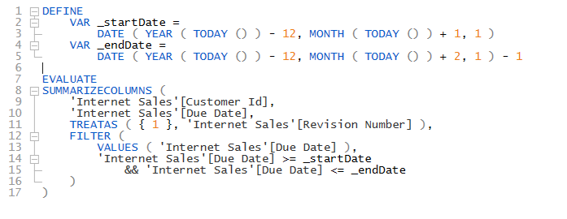

import Issue from '@site/src/components/Github-Issue';

# DAX Studio version 3.0.9

Today we are happy to announce the release of version 3.0.9 of DAX Studio which includes the following fixes and Updates
<!-- truncate -->
:::info
If you are testing DAX Optimizer you should update to this release as it includes  .
:::

# Indent based code Folding

This new preview feature enables the ability to collapse sections of a query based on the indenting levels

You can read more about this preview feature [here](/docs/features/indent-code-folding/) 

# Updates
* Updated Vertipaq Analyzer libraries to work with DAX Optimizer
* Preview - [Indent Based Code Folding](/docs/features/indent-code-folding/) 

# Fixes
* Fix <Issue id="1159"/> Saved Server Timings not loading
* Fix <Issue id="1155"/> add escaping to find references
* Fix <Issue id="1154"/> define measure in calculation groups
* Fix <Issue id="1152"/> typo in Query Builder
* Fix <Issue id="1146"/> Sorting by Translated Names
* Improved DQ formatting

