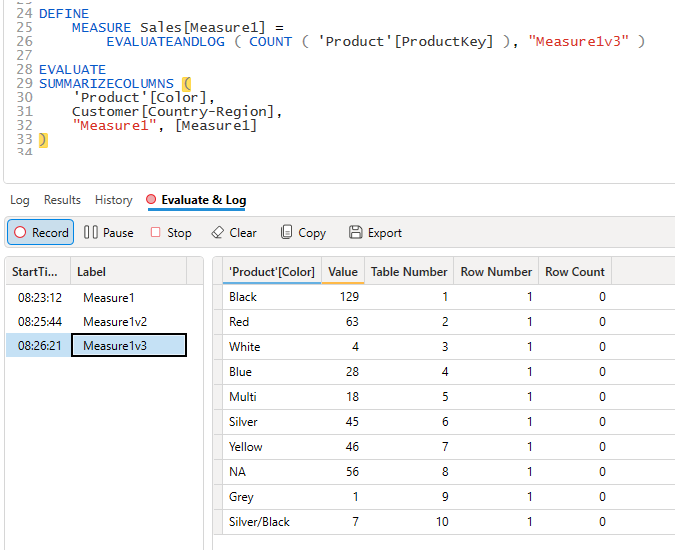

import Issue from '@site/src/components/Github-Issue';

# DAX Studio version 3.1.0

Today we are happy to announce the release of version 3.1.0 of DAX Studio which includes the following fix.

## Highlights

### DSCMD - DAX Studio command line utility
DAX Studio is now shipping with a new utility called `dscmd.exe` this tool is a command line utility so you can run a subset of common operations from a command line.
This means that you can schedule tasks or run them as part of automated build pipelines. [Learn more](/docs/features/command-line)

### Capture Diagnostics
This feature provides an easy way to capture Server Timings, Query Plan and Model Metrics with a single click. 
This works for a single query in the editor or you can run this over the current set of queries in an All Queries trace or from imported Power BI Performance data. 
If you are using the All Queries or Performance Data option only queries matching the filter conditions are captured so you can do things like only capture diagnostics
for queries that run longer than 100ms. [Learn More](/docs/features/capture-diagnostics)

### Database dialog
When connecting to a server with a lot of databases like a Power BI workspace / Fabric it can be frustrating to wait for the first database in the list to populate its metadata
 and then have to change to one of the other database and wait again for the metadata. Now if it detects multiple databases DAX Studio will display a list of them so that
  you can select the one you wish to connect to. The list is sorted alphabetically and has a search box to help quickly locate a specific semantic model [Learn more](/docs/features/database-dialog)

### EvaluateAndLog Trace
The EvaluateAndLog function in DAX provides a way to get visibility of intermediate result sets that are used when evaluating DAX expressions. These can be helpful in diagnosing logic issues.
[Learn more](/docs/features/traces/evaluateandlog-trace)

### Execution Metrics added to Server Timings
The new ExecutionMetrics events are now visible in Server Timings if your data source is capable of emitting those events. [Learn more](/docs/features/traces/server-timings-trace/#execution-metrics-events)

## Full Change List

### New Features
* Added [Capture Diagnostics](/docs/features/capture-diagnostics)
* Added [Evaluate and Log trace](/docs/features/traces/evaluateandlog-trace)
* Added [Database dialog](/docs/features/database-dialog) when connecting
* Added [command line](/docs/features/command-line) support
* Added Model Metrics / Vertipaq Analyzer [Options dialog](/docs/features/model-metrics/#metric-options-dialog)
* Added support for [obfuscated](/docs/features/model-metrics/#obfuscated-vertipaq-analyzer-files) model metrics
* Added support to Server Timings for the new [ExecutionMetrics event](/docs/features/traces/server-timings-trace/#execution-metrics-events)

### Improvements
* <Issue id="1204" /> made listview selected row color lighter to improve the contrast
* <Issue id="1124" /> Improved labelling of the zoom level
* <Issue id="1241"/> Added "learn more" link to connection dialog 
* Added storage mode column to the Partitions tab in View Metrics
* updated TOM, ADOMD and other 3rd party dependencies
* Fixed the images for the Server Timings event type filters
* Moved [Server FE Benchmark](/docs/features/server-fe-benchmark/) out of preview status

### Fixes
* Fixed a crash trying to show fonts in the option dialog
* Fixed <Issue id="1213" /> Formatted file export not applying formatting
* Fixed loading of AggregateRewrite events in saved Server Timings
* Fixed occasional crash when using publish functions
* Fixed <Issue id="1228" /> Query Builder not respecting delimiter setting
* Fixed <Issue id="1179" /> reconnect active traces on connection retries
* Fixed an issue in QueryBuilder when loading a saved query containing a hierarchy
* Fixed an issue in QueryBuilder when trying to filter on a query scoped measure
* Fixed an issue where the Ribbon buttons get stuck in a disabled state after an error while a trace is active
* Fixed <Issue id="1262"/> ViewAs not working with "Other User" option against the Power BI Service
* Fixed <Issue id="1264"/> Status bar timer stopped too early
* Fixed <Issue id="1268"/> where the View As dialog did not work properly with a large number of roles