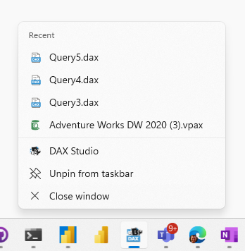

import Issue from '@site/src/components/Github-Issue';

# DAX Studio version 3.2.1

Today we are happy to announce the release of version 3.2.1 of DAX Studio which includes the following new features and fixes.
<!-- truncate -->
## DSCMD - DAX Parameter Support 
If you want to run a DAX query from the command line which has a parameter in it you can now pass a value to be used by that parameter

Both the [CSV](/docs/features/command-line/commands/csv-command) and [XLSX](/docs/features/command-line/commands/xlsx-command) commmands both support passing parameters using the `-m, --parameter` option.

In the following example the query has 2 parameters **@myColor** and **@myCategory** which are passed in using 2 `-m` options

eg.
```
dscmd csv c:\temp\myquery.csv -s localhost\tab19 -d "Adventure Works DW"  ^
  -m myColor=Red ^
  -m myCategory=Bikes ^
  -q "EVALUATE FILTER('product', 'product[Color]=@myColor && 'product'[Category]=@myCategory)"
```

## Improved Jumplist Integration
The Jumplist is a feature of Windows 10 & 11 where right clicking on a program in your task bar would show you recently opened files.



Previously this list was only populated when you double clicked on a file that was associated with DAX Studio in Windows Explorer. Now DAX Studio will add items to this list when you open or save files making the Jumplist much more usable since it will be a true reflection of recently used files.

## Full Change List

### Updates 
* Adding DAX parameter support to CSV & XLSX commands
* Improved Jumplist integration

### Fixes
* <Issue id="1292"/> grid output not binding results with > or & in the column name
* <Issue id="1293"/> Vertipaq Options dialog learn more link broken
* <Issue id="1298"/> Adding Advanced XLSX output settings in Options
* <Issue id="1302"/> Fixing DirectLake mode option not working in View Metrics dialog
* <Issue id="1305"/> All Queries not capturing events
* <Issue id="1306"/> dscmd VPAX command not using default value for StatsColumnBatchSize
* fixing crash on exit