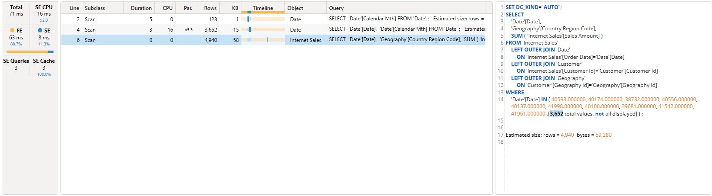

import Issue from '@site/src/components/Github-Issue';

# DAX Studio version 3.5.0

## New
* Added support for expand/collapse in [query plans](../../docs/features/traces/query-plan-trace)

* Added syntax highlighting to SE events

* Adding ctrl+r support to maximize editor view (<Issue id="863"/>)
* Adding support for UDFs in code completion and Functions tab
* Adding support for custom calendars in code completion
* Moved indent based code folding out of preview status

## Updates
* Updated dependencies including v19.113.2 of AMO / ADOMDClient

## Fixes
* Fixed <Issue id="1414"/> Export data to parquet shows incorrect progress count
* Fixed <Issue id="1415"/> export to parquet saving partial results
* Fixed <Issue id="1417"/> update ODC name when exporting live connection to Excel
* Fixed <Issue id="1421"/> allowing the use of guid or tenant name when establishing b2b connections
* Fixed <Issue id="1434"/> updated code signing timestamp server
* Fixed <Issue id="1427"/> EvaluateAndLog trace can break when logging tables
* Fixed <Issue id="1424"/> typo in error message
* Fixed <Issue id="1425"/> export to excel not able to be read by power query
* Fixed race condition that occasionally prevented metadata pane from loading when opening vpax file
* Fixed a rare startup crash
* Fixed async issue in benchmarks

<!-- truncate -->