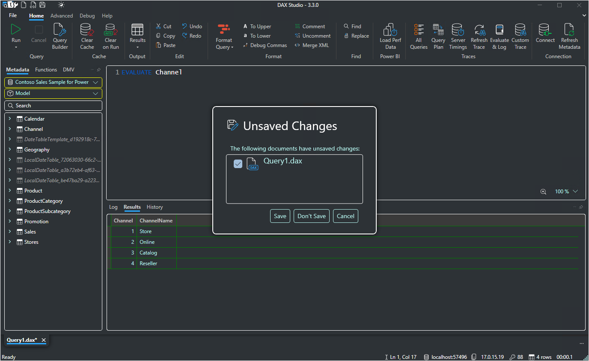
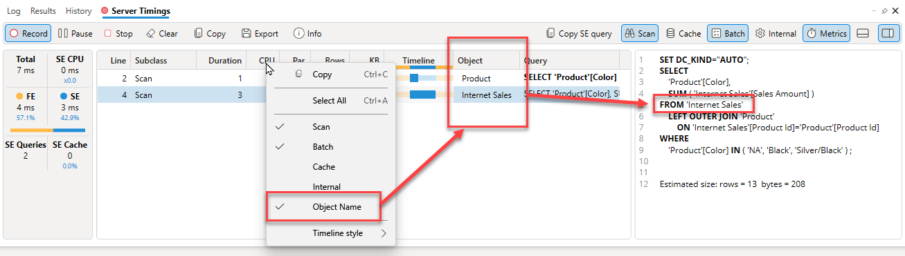
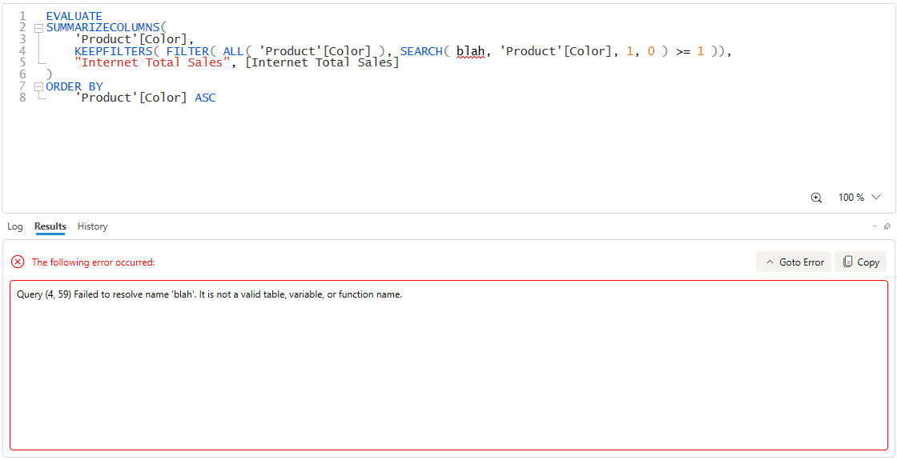
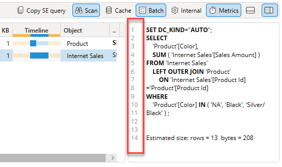
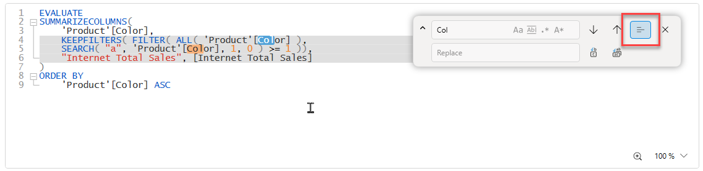

import Issue from '@site/src/components/Github-Issue';

# DAX Studio version 3.3.0

Today we are happy to announce the release of version 3.3.0 of DAX Studio which includes the following new features and fixes.
<!-- truncate -->

## New Features
### DSCMD - added support for connecting to open Power BI Desktop files 

When using [dscmd](/docs/features/command-line) it is now possible to specify a connection to a file that is open in desktop. 

If the `--server` parameter ends in .pbix or .pbip then dscmd will scan the local machine for currently running instances using the same logic that the DAX Studio UI does and will connect to the model with the matching file name.

eg.

`dscmd csv c:\temp\stores.csv --server "adventure works.pbix" --query "EVALUATE stores"`

:::info
Note that dscmd cannot query a pbix/pbip file directly, the file needs to be already open in Power BI Desktop.
:::

### Added support for High Contrast Windows themes

DAX Studio now has support for High Contrast Windows themes. Prior to this version some parts of the application had support while others did not resulting in a crash relating to missing resources. We now have a separate theme that explicitly supports high contrast mode. 

### Added ObjectName to Server Timings

There is an option in the right-click menu on the Server Timings grid to turn on the display of the **Object Name** column. This column shows the main object that was referenced during a scan or DQ operation and can be useful for quickly seeing which scans reference a specific fact table.

### Displaying query errors in the results pane

From <Issue id="1361"/>:  The results pane now has an improved error display with a number of user experience improvements.

* Before this the results of any prior valid query were retained which could have lead to confusion
* Large error messages often scroll out of view in the log pane and can be difficult to navigate to
* There is a **Copy** button if you need the error text for use in a search engine or support ticket
* There is a **Goto Error** button which will position your cursor at the error location if one is mentioned in the error message

### Line numbers to Server Timings query pane

From <Issue id="1358"/>. The Query text in the Server Timings window now has line numbers to make it easier to reference parts of the query when doing presentations or screenshares.

### Find/Replace in selection

There is a new toggle button in the [Find/Replace](/docs/features/find-replace/) window that allows the user to restrict the find and replace operations to a specific selection. When the selection mode is active the background of the selection is colored to show the scope that the find/replace operation is working inside. This scope can be cleared by toggling the button or by closing the find/replace dialog.

## Updates
* <Issue id="1359"/> saving error message in Server Timings and allowing copying of error
* Improved EntraID auth in dscmd
* Improved responsiveness while refreshing metadata against slow sources
* Improved code folding logic
* Find/Replace - pressing Enter key will trigger find next
* Find/Replace - search while user types
* <Issue id="1369"/> added tooltips to ServerTimings columns
* <Issue id="1368"/> added right click copy / select all to vertipaq analyzer
* <Issue id="1370"/> added tooltip to View As button
* Updated dependencies
* Updated .Net framework version to 4.7.2
* Improved Server Timings debug logging
* Improved trace startup timeout checks
* Improved reliability of Benchmarking and Capture Diagnostics
* Improved insertion logic when defining measures
* Improved backward compatibility when loading Server Timings

## Fixes
* Fixed <Issue id="1332"/> Define Dependent Measure and Expand Measures not working reliably
* Fixed detection of FormatString property in results
* Fixed crash when launched from Excel but there is no active query window
* Improved handling of embedded line breaks in linked Excel output
* Fixed Server Timings timeline caching bug
* Removed duplicate Metadata Refreshed log messages
* Fixed <Issue id="1324"/> All queries threading bug
* Fixed race condition in Benchmarking
* Fixed <Issue id="1330"/> Improved Font zooming in editor
* Fixed bug setting query parameter values from XML 
* Fixed <Issue id="1336"/> trace start error when switching some connection types
* Fixed <Issue id="1331"/> prevent code completion display for numbers
* Fixed <Issue id="1323"/> adding support for `// Query` comments when pasting DQ queries
* Fixed opening daxx file from inside a zip file
* Fixed <Issue id="1356"/> crash when defining measures from editor
* Fixed loading of daxx files from readonly locations 
* Fixed incorrect validation error in Query Builder when loading non-string filters
* Fixed Find/Replace not working in QueryBuilder Measure Editor
* Fixed down arrow selecting from the database dialog
* Fixed <Issue id="1371"/> File-Exit not triggering save changes dialog