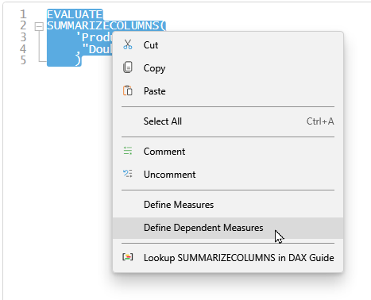
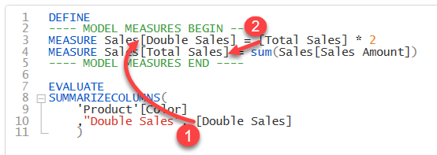

import Issue from '@site/src/components/Github-Issue';

# DAX Studio version 3.3.2

## Updates
* Added option to show whitespace and control characters in editor
* Added SQL and TabularQuery filter buttons to Server Timings
* Added the [accesstoken](/docs/features/command-line/commands/accesstoken-command) command to dscmd
* Right-click define measures / define dependent measures works when a query is selected and just defines the measures referenced in that query

If you select an entire query and choose the option to **Define measures** or **Define dependent measures**

DAX Studio will then inject all the measures reference in the query

you can see that: 
1. the measure that is referenced directly in the query has been defined
2. the dependent measure has also been defined

## Fixes
* Fix <Issue id="1388"/> Statusbar timer reseting to 0:00.0
* Fixed race condition when opening file from command line parameter
* Fix <Issue id="1389"/> close dialog button not working consistently
* Fix <Issue id="1390"/> error with authentication for B2B users
* Fix <Issue id="1392"/> including table name when defining measures
* Fixed History pane filtering when connected to Power BI Desktop
* Fix <Issue id="1394"/> allow for name sorting in all Metrics views
* Fix <Issue id="1395"/> updated clipboard retries and error display when using clipboard output
* Fix View Metrics incorrectly opening a second pane 

<!-- truncate -->