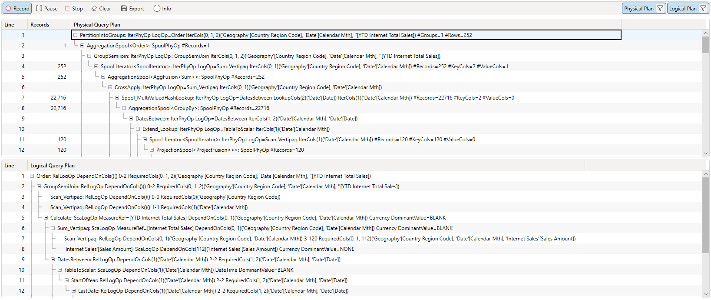
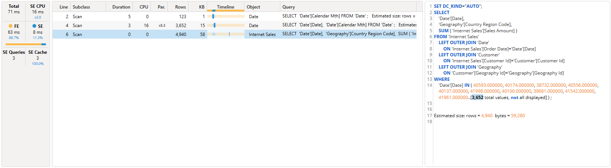

# DAX Studio version 3.5.0

## New
* Added support for expand/collapse in [query plans](../../../docs/features/traces/query-plan-trace)

* Added syntax highlighting to SE events

* Adding ctrl+r support to maximize editor view (#863)
* Adding support for UDFs in code completion and Functions tab
* Adding support for custom calendars in code completion
* Moved indent based code folding out of preview status

## Updates
* Updated dependencies including v19.113.2 of AMO / ADOMDClient

## Fixes
* Fixed #1414 Export data to parquet shows incorrect progress count
* Fixed #1415 export to parquet saving partial results
* Fixed #1417 update ODC name when exporting live connection to Excel
* Fixed #1421 allowing the use of guid or tenant name when establishing b2b connections
* Fixed #1434 updated code signing timestamp server
* Fixed #1427 EvaluateAndLog trace can break when logging tables
* Fixed #1424 typo in error message
* Fixed #1425 export to excel not able to be read by power query
* Fixed race condition that occasionally prevented metadata pane from loading when opening vpax file
* Fixed a rare startup crash
* Fixed async issue in benchmarks

{/* truncate */}