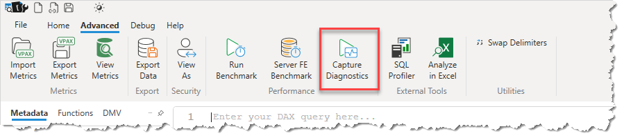
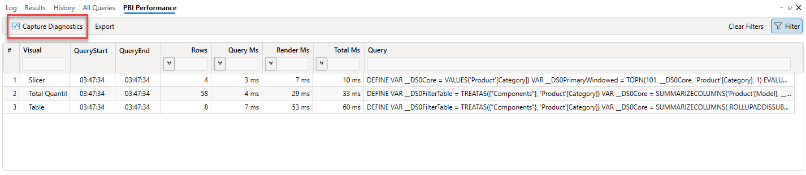

Capture Diagnostics is designed as a way to capture diagnostic information about 1 or more queries in a single file. This file can then be used for later analysis.

When you click the Capture Diagnostic it will automate performing the following actions.
1. Running **View Metrics** 
1. Starting a **Server Timings** trace
1. Starting a **Query Plan** trace
1. Running a **Clear Cache** command
1. Saving the results as a .daxx file (or saving multiple daxx files to a zip file)

Capture Diagnostics can be trigged in a number of different ways.

It is available as a button in the Advanced Ribbon. In this scenario it will attempt to capture diagnostics against the query in the editor window. If there is no text in the editor window it will check the clipboard contents for a possible DAX query and use that.

It is also available in both the All Queries Trace window: 

And in the Power BI Performance Data window:

In both of these cases you can use the filter option to further refine the list of queries. For example you can filter for only those that took longer than a given duration. The Capture Diagnostics option will then run all of the selected queries and save the results in a single .zip file.

