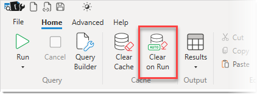

This is a toggle button, when it is enabled it will automatically execute a [Clear Cache](../clear-cache) command before running a query. This is useful in performance tuning situations where you want to tune for the worst case scenario.

