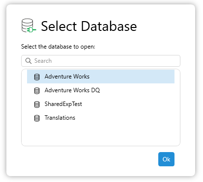

The database dialog is shown when connecting to a data source which has more than one database / semantic model.

This dialog presents the user with an alphabetically sorted, searchable list of data models so that they can connect directly to that data model rather than connecting to the first one alphabetically and then having to change the selected database.

