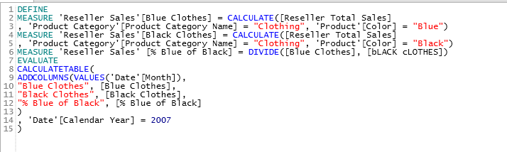
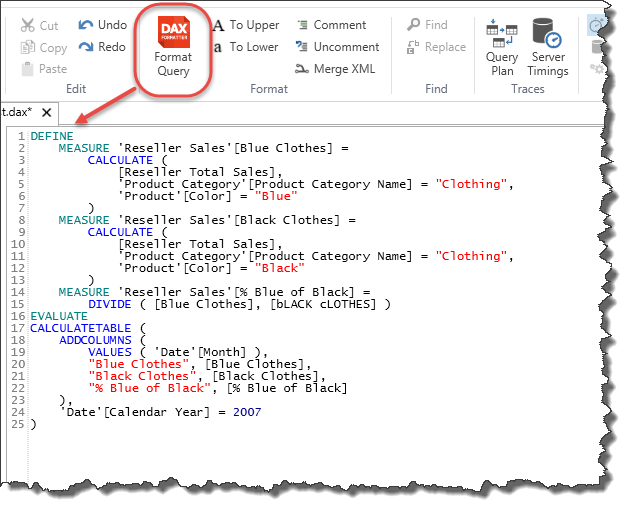

DAX Studio has built-in support for formatting queries using [www.daxformatter.com](http://www.daxformatter.com) (so you must have an internet connection in order to format a query)

For example if you typed the following query: 

Clicking on the DAX Formatter button (or pressing F6) will format your query 