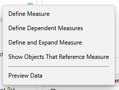
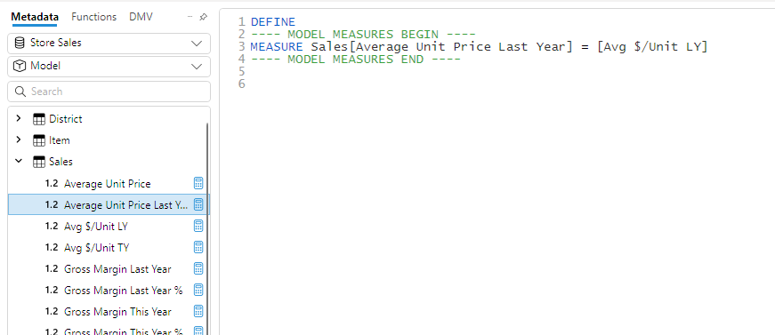
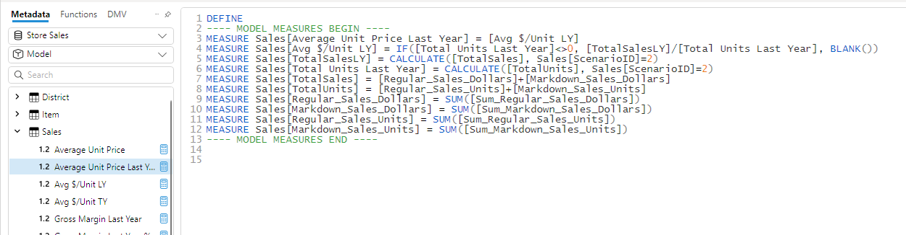
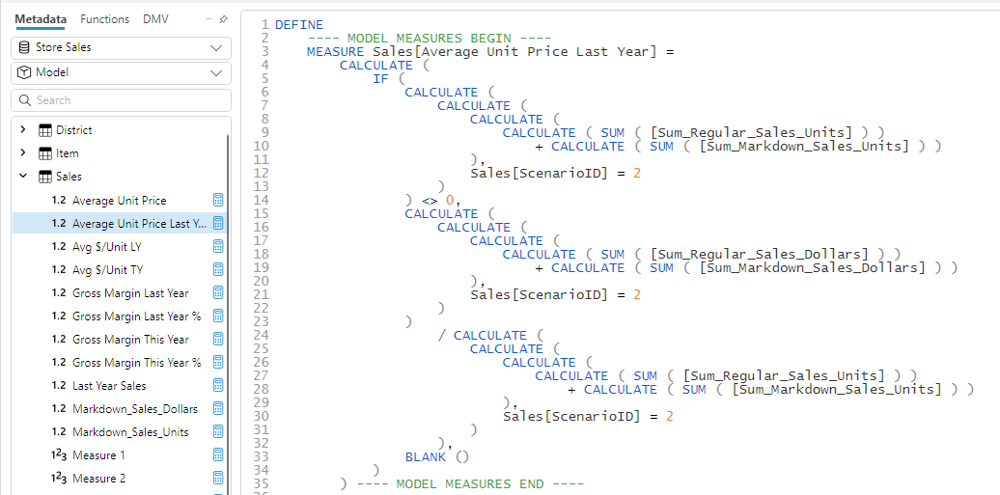
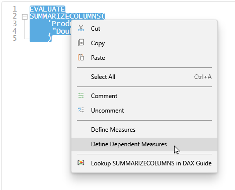
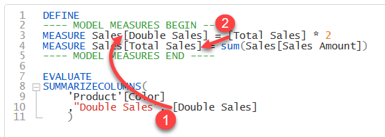

When you right-click on a measure in the [metadata pane](../metadata-panes) there are a number of options available for defining measures

## Define Measure
This will extract the DAX expression for the selected measure and insert it at the top of the current query in the edit window in a `DEFINE` block. You can then make edits to this expression and those changes will only be scoped to the current query in DAX Studio. The measure in your model is not changed, the `DEFINE` block lets you override the definition of the measure for just the current query. 

## Define Dependent Measures
This works similar to the **Define Measure** feature, but it also recursively scans the measure expression for any other measures that are referenced and includes those in the `DEFINE` block. This feature lets you override any of the measures in the dependency chain since a logic or performance issue in one measure could actually be caused by a downstream dependency

As you can see in the example below, choosing the **Define Dependent Measures** option includes not only the selected measure, but every other measure in the chain of dependencies which this measure depends on.

:::info
This is great when testing different variations of a measure for logic or performance improvements and also well when using the [EvaluateAndLog trace](../traces/evaluateandlog-trace)
:::

## Define and Expand Measure
Sometimes a top level measure can look quite simple, but it may be referencing a chain of other measures causing context transitions. This feature will expand out all of the underlying measures and insert their expressions in-line into the `DEFINE` block. 

This example is similar to the one above, but instead of defining each measure independently it inserts the expressions inline into one large expression. This helps you to see the impact of all the different measure references and gives more visibility on the work the DAX engine has to perform to resolve the original measure.

## Editor support
The define measure features also work in the code editor you can right click on a measure in the editor and generate a define. 

Or if you select an entire query and choose the option to **Define measures** or **Define dependent measures**

DAX Studio will then inject all the measures reference in the query

you can see that: 
1. the measure that is referenced directly in the query has been defined
2. the dependent measure has also been defined