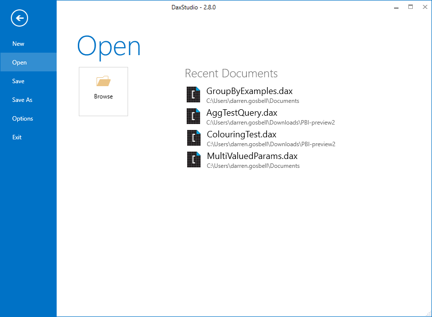

The DAX Studio File menu gives you access to open .dax and .msdax file. It also contains a list of recently used files and gives you access to the options menu.

## Searching recent files

DAX Studio 3.6.0 added a search box above the list of recently used files. Typing in the box filters the list, which is useful when you have a long list of recent files and want to find a specific one quickly.

The search is not case sensitive and matches on either the file name or the folder, so you can type part of a folder path to narrow the list down to the files in a particular project.