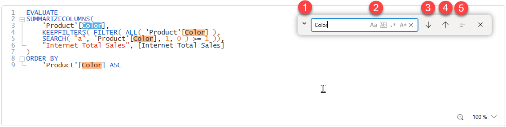
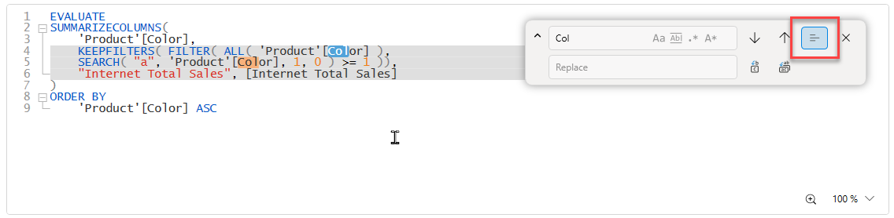

## Find
The editor in Dax Studio supports Find (Ctrl+F)



1. This arrow opens up the replace section of the dialog
2. These options control how behaviour of the search dialog
3. Find next
4. Find previous
5. Find in selection

### Find Options

 Make the find case-sensitive (the default is case insensitive)

 find whole words

 find using regex patterns

 find using wildcards * for multiple characters ? for single characters

### Find in selection

This option allows for the find/replace operations to be constrained to a selected area of text within the editor. To use this option you open the Find/Replace dialog, then select an area of text and click the "Find in selection" button to restrict the find/replace scope to text within that selection. When this feature is active the toggle button will be active and a gray background will show you which area of text is considered part of the find/replace scope. Toggle this button off to reset the search scope back to the entire document.



## Replace
Replace (Ctrl+H) allows for the replacement of the search text with the specified replacement text

 replace just the current match

 replace all text that matches the find expression

## Examples

### Wildcards

When using the wildcard option there are 2 supported wildcards

* **\*** matches 1 or more of any character
* **?** matches any single character

| Example | Description |
| :--- | :--- |
| F\*R | this matches any text that has an F followed by any number of characters and then an R<br/>eg. FILTER, FOR, FEAR  |
| F?R | this matches any text that has an F followed by a single character and then an R<br/> eg. FOR, FAR, FIR |
| [\*] | this matches any text between square brackets<br/> eg. [Color], [Total Sales] |

### Regex

Regex expressions can get very complex and you can not only use these in find expressions, but you can also use capture groups in replace expressions.

| Example | Description |
| :--- | :--- |
| ```(?<='Product'\[)([^\s]*?)(?=\])``` | This matches text that has a prefix of `'Product'[` and a suffix of `]` but does not have any whitespace. <br/>This will match `Color` in `'Product'[Color]`<br/>But will not match `Product Category` in `'Product'[Product Category]` (since it has a space in the column name)|