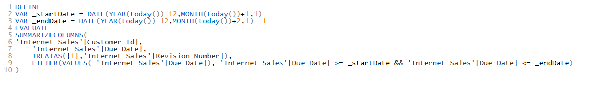
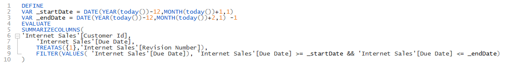
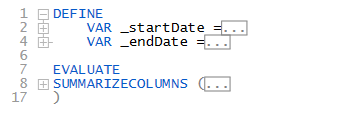

:::info
This is a preview feature an needs to be enabled using the setting under Options > Preview
:::

DAX Studio does not have a fully featured DAX parser making some features like code folding impossible to implement correctly, but this feature provides an interesting work around which works for "well formatted" DAX code by allowing the code to be collapsed based on indentation levels. This does allow for some interesting use cases where you can indent a block of code from a long query and collapse it so that you can view just the portions of code that are of interest to you in a single screen.

If we take the following query as an example

When we turn on the indent based code folding we see that lines 6-9 can be collapsed

However if we use the [Format DAX](../daxformatter-support) to format the code we can see how it is now possible to collapse logical blocks of the code

This allows us to collapse variables and measures or function calls so that it is possible to just focus on a specific part of the query

