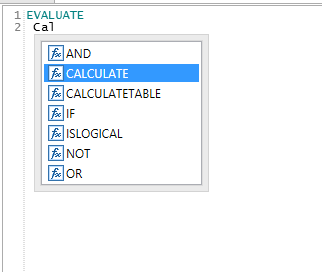
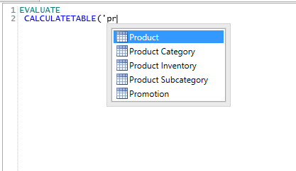
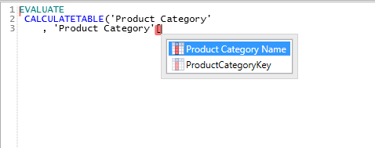
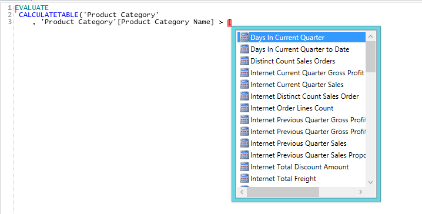

DAX Studio provides full code completion support

:::info Currently DAX Studio does not support variables in code completion :::

The code completion is based on the best practice of always prefixing columns with the table name and never prefixing a measure with a table name. So if you type *'table name'[* you will get code completion for all the columns in the ‘table name’ table. But if you just type *[* you will be presented with a list of all the measures in the model.

It will list both Functions and Keywords:

Tables:

Columns:

and measures:

