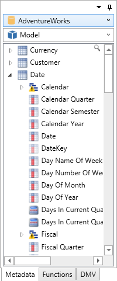
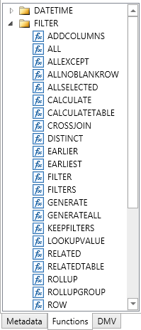
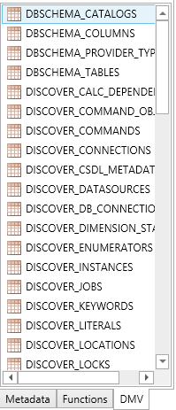

DAX Studio has 3 different metadata panes. With all the metadata panes you can either double click on an item to insert it into the current position of the editor or you can drag the item and drop it in a selected position in the query pane.

### Model Metadata
The model metadata pane shows information about the currently connected data source. You can use the database and model drop downs at the top of the pane to select which metadata to display (note that for some data sources like Excel and Power BI Desktop the database dropdown is disabled as these data sources can only have a single database). The [Model Metadata](/docs/features/model-metadata) pane can display information about a number of different objects in the model

### Function Metadata
The function pane shows all the available DAX functions. This information is queried from the data source each time, so the list of functions should always represent the full list available for that data source. This is very useful for data sources like Power BI Desktop where new functions may be delivered in one of the monthly updates  

### DMV Metadata
DMVs or [Dynamic Management Views](../dmv-list) are a way of querying information from the data source. You can get both information about the structure of the data and regarding some of the internal state of the "server" (such as memory usage and the current number of sessions or connections)

