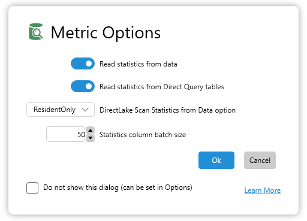

DAX Studio has the ability to analyze your data model and report on the memory usage. This can be extremely helpful when performance tuning as the more memory your data structures require, the slower they are to both process and query.

:::info
 all the metrics relate to the memory used by the model when it is loaded into memory. When the model is saved to disk extra compression is applied which may result in a smaller size than the total size reported by the view metrics screen (although we have seen some unusual cases where the size is larger)
:::

The metrics features can be found on the **Advanced** tab in the DAX Studio ribbon. There are 3 buttons in the metrics section these are:

* [**Import Metrics**](#importing-metrics) : this will open a previously saved .vpax file
* [**Export Metrics**](#exporting-metrics) : this will create a .vpax file which you can open later.
* [**View Metrics**](#view-metrics) : this will analyze the current model and produce a report


## Importing Metrics
DAX Studio will let you open a `.vpax` file and will display the data in the same way as if you had clicked the **View Metrics** option. This is useful for sharing your metrics with someone else or saving a snapshot for later comparison. If you import a `.ovpax` file DAX Studio will attempt to deobfuscate it using the [following steps](#importing-obfuscated-files)

## Exporting Metrics
When you export the metrics this gives you the option to save as one of the following file formats
* `.vpax` - standard Vertipaq Analyzer file
* `.ovpax` - obfucated Vertipaq Analyzer file - see [Obfuscated Vertipaq Analyzer Files](#obfuscated-vertipaq-analyzer-files)

## Metric Options Dialog

This dialog allows you to override the default statistic scanning behaviour for the current operation. This dialog will display when Viewing or Exporting metrics.



| Option | Default | Description |
|:---|:---|:---|
| Read Statistics from data | true | Scan the data to retrieve accurate statistics about columns, tables and relationships.|
| Read Statistics from Direct Query data | false | Include Direct Query tables in statistics collection. This is a lot more expensive than reading statistics from in-memory columns and is not recommended. |
| Direct Lake scan statistics from Data option | ResidentOnly | **ResidentOnly** only scans columns that are already loaded into memory <br/>**Referenced** scans columns that are already <br/>resident and columns referenced in measures or relationships<br/>**Full** scans all columns, forcing them into memory (not recommended for large models)|

## View Metrics

When you choose the **View Metrics** option a window is displayed with the following tabs

### Table Metrics

This is the default view as it shows the most important and most actionable information. It shows the table information, but also lets you expand the tables to see the information on the columns for that table. By default this view is sorted to show the tables/columns that use the most memory first.


### Column Metrics

This view shows the same information as the tables tab, but it does not group the columns inside tables, they are all sorted in one flat list. 


### Relationships

This tab shows information about the relationships in your model


### Partitions

By default every table has at least 1 partition. For large models in AzureAS, SSAS on-prem or Power BI with incremental processing enabled you will often have tables with multiple partitions. This view shows information about those partitions.


### Summary

This view shows you the total memory usage information for your model as well as information about the compatibility mode, when it was last process and when this analysis was run.


## Required Permissions

The View Metrics feature needs to run queries against both the data and DMV queries against the model metadata. The end user that is viewing or exporting the metrics needs to have read/write access to the data model in order to execute these queries.

| Environment | Minimum Permissions | 
| --- | --- | 
| Power BI Desktop / SSDT / Power Pivot | n/a - user has full permissions by default |
| Power BI Premium (XMLA Endpoint) | Contributor | 
| Azure AS / SSAS | Database Admin | 


## Obfuscated Vertipaq Analyzer files

DAX Studio has the ability to export and import obfuscated files. These are mainly useful if you want to obfuscate the files for the [DAX Optimizer](https://daxoptimizer.com) service

### Exporting Obfuscated files

When you save as a `.ovpax` file there will actually be 2 files produced
1. a `.ovpax` file with randomized names for the tables/columns/measures
1. a `.dict` file containing a mapping from the randomize names to the actual names

The main reason you may want to use a `.ovpax` file is if you want to send this file to an external service such as https://daxoptimizer.com but you are concerned that you do not want to share potentially identifiable information.

:::info
**DAX Studio** never overwrites `.dict` file. If a file with the default name already exists **DAX Studio** will add a numeric suffix to the file name.
:::

There are 2 options when creating a `.ovpax` file. 


### Importing Obfuscated files
When you attemtpt to open a `.ovpax` file DAX Studio checks a couple of things

1. If there is a `.dict` file in the same folder as the `.ovapx` with the same filename that file will be used.
2. If there is no matching `.dict` file or if there are multiple matching `.dict` files DAX Studio will prompt for which one to use.

:::note
If a `.dict` file is not found and one is not provided the obfuscated file will open and you will be able to see all the statistics, but the object names will be the obfuscated ones.
:::

**Example 1.** If there is a single `.dict` file with the same name as the `.ovpax` DAX Studio will use that `.dict` file to deobfuscate the data.
```
|- AdventureWorks.ovpax
|- AdventureWorks.dict
```

**Example 2.** If there are multiple `.dict` files with the same prefix as the `.ovpax` file DAX Studio will prompt the user for which one to use.
```
|- AdventureWorks.ovpax
|- AdventureWorks.dict
|- AdventureWorks (2).dict
```

**Example 3.** If there is no `.dict` file and you cancel the dialog prompting for the `.dict` location DAX Studio will load the obfuscated file _as is_ with the obfuscated names.
```
|- AdventureWorks.ovpax
```

### Further Reading

For a detailed explanation of how obfuscation works and why you might want to use it you can find more information in [**this video**](https://www.youtube.com/watch?v=UTCnjzgsz4A&ab_channel=SQLBI) from SQLBI.

[def]: obfu