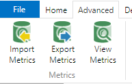
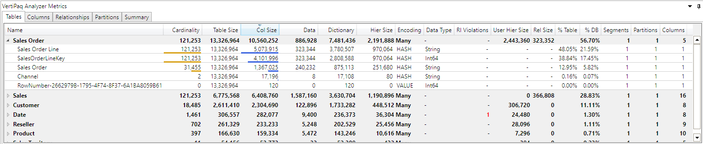
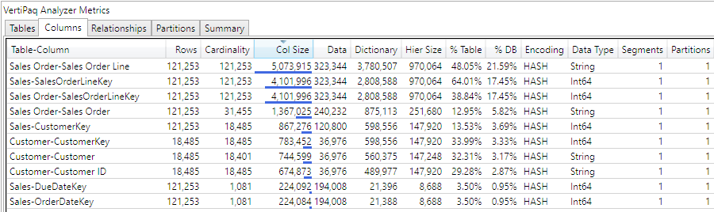
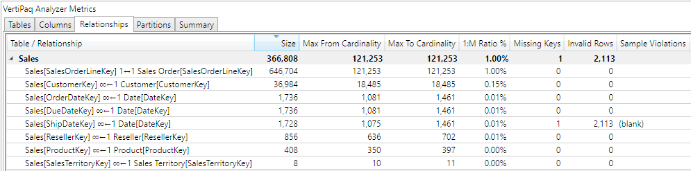
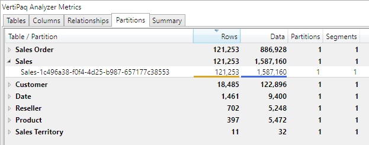
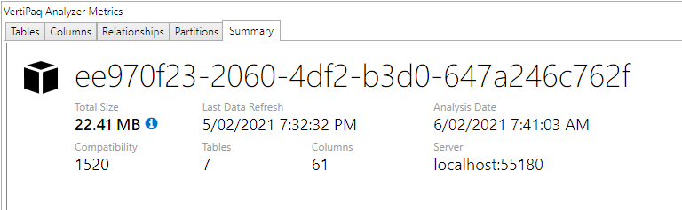

DAX Studio has the ability to analyze your data model and report on the memory usage. This can be extremely helpful when performance tuning as the more memory your data structures require, the slower they are to both process and query.

> Note: all the metrics relate to the memory used by the model when it is loaded into memory. When the model is saved to disk extra compression is applied which may result in a smaller size than the total size reported by the view metrics screen (although we have seen some unusual cases where the size is larger)

The metrics features can be found on the **Advanced** tab in the DAX Studio ribbon. There are 3 buttons in the metrics section these are:

* **View Metrics** : this will analyze the current model and produce a report
* **Import Metrics** : this will open a previously saved .vpax file
* **Export Metrics** : this will create a .vpax file which you can open later.

## View Metrics

When you choose the **View Metrics** option a window is displayed with the following tabs

### Table Metrics

This is the default view as it shows the most important and most actionable information. It shows the table information, but also lets you expand the tables to see the information on the columns for that table. By default this view is sorted to show the tables/columns that use the most memory first.

### Column Metrics

This view shows the same information as the tables tab, but it does not group the columns inside tables, they are all sorted in one flat list. 

### Relationships

This tab shows information about the relationships in your model

### Partitions

By default every table has at least 1 partition. For large models in AzureAS, SSAS on-prem or Power BI with incremental processing enabled you will often have tables with multiple partitions. This view shows information about those partitions.

### Summary

This view shows you the total memory usage information for your model as well as information about the compatibility mode, when it was last process and when this analysis was run.

## Required Permissions

The View Metrics feature needs to run queries against both the data and DMV queries against the model metadata. The end user that is viewing or exporting the metrics needs to have read/write access to the data model in order to execute these queries.

| Environment | Minimum Permissions | 
| --- | --- | 
| Power BI Desktop / SSDT / Power Pivot | n/a - user has full permissions by default |
| Power BI Premium (XMLA Endpoint) | Contributor | 
| Azure AS / SSAS | Database Admin | 
