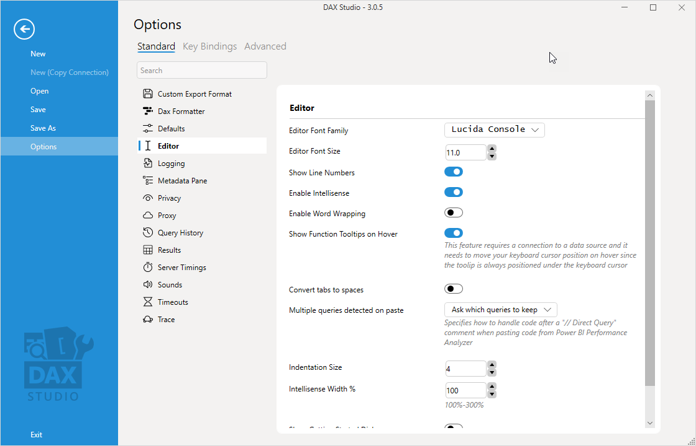

DAX Studio offers a number of options which users can use to customize their experience.

The options list can either be navigated by clicking on one of the categories on the left hand side

Or you can use the search box to find specific settings

## Custom Export Format

| **Setting** | **Description** | **Default** |
| --- | --- | --- |
| CSV Delimiter | Specifies what field delimiter should be used when exporting to CSV | Default List separator character (from regional settings) |
| 'Other' Delimiter | The delimiter to use when **CSV Delimiter** is set to **Other** | n/a |
| Quote String Fields | Sets whether string fields should always be quoted | true |

## DAX Formatter

| **Setting** | **Description** | **Default** |
| --- | --- | --- |
| Default Format Style | Specifies whether DAX Formatter should favour Long or Short lines | Long Line|
| Skip space after function name | Specifies whether a space should be skipped after a function name | false |

## Defaults

### Benchmark

| **Setting** | **Description** | **Default** |
| --- | --- | --- |
| Cold Cache Runs Enabled | Sets whether cold cache runs should be executed | True |
| Cold Cache Runs  | Sets the default number of cold cache runs when benchmarking | 5 |
| Warm Cache Runs Enabled | Sets whether warm cache runs should be executed | True |
| Warm Cache Runs | Sets the default number of warm cache runs when benchmarking  | 5 |

### Defaults

| **Setting** | **Description** | **Default** |
| --- | --- | --- |
| Separators | This setting can either be set to US/UK (commas as the list separator character) style or Other (semi-colons as the list separator character) | US/UK |
| Enable Clear Cache Auto by default | checking this option will enable **Auto Clear Cache** by default | False | 
| Show Username in Titlebar | This option will show the current windows login in the title bar | False |

### Theme
| **Setting** | **Description** | **Default** |
| --- | --- | --- |
| UI Theme / Mode (Light, Dark, Auto) | This setting will change the current app theme. This can also be changed by clicking on the icon in the title bar| Auto |

## Editor

These settings control the display and behaviour of the main editor window

| **Setting**       | **Description** | **Default** |
| --- | --- | --- |
| Editor Font Family       | Sets the font used by the Query Editor pane | Lucida Console |
| Editor Font Size         | Sets the default font size (in points) | 11pt |
| Show Line Numbers | controls whether line numbers are displayed | true |
| Enable Intellisense | whether to display Intellisense options while typing in the query editor | true |
| Enable Word Wrapping | whether to word wrap the query editor so that the horizontal scroll bar is not used | false |
| Convert Tabs to Spaces | if this setting is TRUE hitting the tab key will insert spaces instead of a tab character. The number of spaces inserted is controlled by the **Indentation Size** setting. | False |
| Indentation Size | This is the number of spaces to insert if **Convert tabs to spaces** is set to TRUE. | 1 |
| Intellisense Width | this option can be used to increase the default size of the intellisense dropdown window | 100% |
| Show Getting Started Dialog | Controls whether the **Getting Started** Dialog is shown when you first connect to a data source | True |

## Logging
| **Setting**       | **Description** | **Default** |
| --- | --- | --- |
| Logging Level | Sets the default level of information written out to the log file | Warning |

## Metadata Pane

### Automatic Metadata Refresh

These setting control the bahaviour of the automatic metadata refresh

| **Setting** | **Description** | **Default** |
| --- | --- | --- |
| Prompt before refreshing Metadata | Controls whether DAX Studio will show a prompt before refreshing metadata | False |

## Detect Metadata Changes

These settings control which connection types DAX Studio will automatically check for metadata changes

| **Setting** | **Description** | **Default** |
| --- | --- | --- |
| Local Connections | For any connections to localhost (eg. PowerPivot, Power BI Desktop, SSDT)| true |
| Network Connections | For any connections to SSAS | true |
| Cloud Connections | For any connections to data sources that start with asazure:// or powerbi:// | false |

## Scrollbars

| **Setting** | **Description** | **Default** |
| --- | --- | --- |
| Auto hide vertical scroll bars | Controls whether the vertical scroll bar will auto hide | True |

### Preview Data
| **Setting** | **Description** | **Default** |
| --- | --- | --- |
| Row Limit for Preview Data | Controls how many rows are returned when you choose the **Preview Data** option from the right-click menu | 500 |

### Tooltips

This section controls what additional information is displayed in the tooltips for various metadata objects

| **Setting** | **Description** | **Default** |
| --- | --- | --- |
| Show Basic Statistics | This will show statistics like min/max/distinct values for a column | true |
| Show Sample Data | This will show a sample of 10 values from a given column | true |

### Hidden Objects

This section controls the visibilty of hidden objects in the Metadata pane.

| **Setting** | **Description** | **Default** |
| --- | --- | --- |
| Show Hidden columns, tables and Measures | This setting allows for the showing of objects that are hidden in the normal report views | true |

### Sorting

This section controls the sorting of objects in the Metadata pane.

| **Setting** | **Description** | **Default** |
| --- | --- | --- |
| Sort Folders First in metadata pane | This setting will force folders to be sorted first in the metadata pane | true |

## Privacy

| **Setting** | **Description** | **Default** |
| --- | --- | --- |
| Block All Internet Access | Stops DAX Studio from all external access. This option can only be set by an administrator during an 'All Users' install and overrides all the other options below. (and they will show up as disabled when this option has been set) | false |
| Block Version Checks | Stops DAX Studio from checking for and notifying of available updates | false |
| Block Crash Reporting | Stops DAX Studio from sending crash reports to the developer. There is a small chance that the screenshot of the crash could include personal information. Although you can untick the option to include the screenshot in the report if this is the case. | false |
| Block External Services | Stops DAX Studio from accessing external services (such as DaxFormatter.com). We never send any data externally, but there is a small chance that query text might contain personal information if you were writing queries that filtered for specific information like Customer Names | false |

## Proxy

These settings control if/how DAX Studio will use a Proxy server to connect to online services (like DaxFormatter.com and crash reporting)

| **Setting** | **Description** | **Default** |
| --- | --- | --- |
| Use System Proxy | If set to true DAX Studio will attempt to use the Proxy settings from the operating system | true |
| Proxy Address | The url for your proxy server | _(blank)_ |
| Proxy User | The username for accessing the Proxy server | _(blank)_ |
| Proxy Password | The password for accessing the Proxy server | _(blank)_ |

## Query History

DAX Studio keeps a log of recently executed commands (both successful and failed commands)

| **Setting** | **Description** | **Default** |
| --- | --- | --- |
| History Items to keep | by default DAX Studio keeps a limited number of recent queries (_Note: setting this number too high can affect the startup time for DAX Studio_)  | 200 |
| Show Trace Timings (FE/SE) | This setting controls whether any trace timings are also capturd in the query log | true |

## Results

These settings change settings for the Results window

| **Setting** | **Description** | **Default** |
| --- | --- | --- |
| Automatic Format Results | This setting controls whether the results pane attempts to automatically format numbers and percentages | false |
| Default Date Automatic Format | Controls the default date format when **Automatic Format Results** is enabled | yyyy-MM-dd |
| Font Family | This sets the font for the results pane | Segoe UI |
| Font Size | This is the default size for the results font | 11pt |
| Scale Font with Editor | When this option is selected increasing the zoom factor on the editor will also increase the zoom for the results pane | true |

## Server Timings

| **Setting** | **Description** | **Default** |
| --- | --- | --- |
| Highlight Vertipaq Callbacks | Highlight xmSQL queries containing callbacks that don't store the result in the storage engine cache. | true |
| Replace column ID with name | Replace xmSQL column ID with corresponding column name in data model. | true |
| Replace table ID with name | Replace xmSQL table ID with corresponding column name in data model. | true |
| Simplify SE query syntax | Remove internal IDs and verbose syntax from xmSQL queries. | true |

## Sounds

| **Setting** | **Description** | **Default** |
| --- | --- | --- |
| Play a sound after long running operations | Will play a sound after long running operations (export/benchmark/view metrics/queries) |  false |
| Only Play a sound is not active | Only play a sound if DAX Studio is not the active application |  false |
| Long Operation Sound | |  Beep |
| Long Query Seconds | If a query takes more than this number of seconds it will trigger the **Long Operation Sound** |  10 sec |

## Timeouts

These settings control the length of various timeouts for potentially long running operations

| **Setting** | **Description** | **Default** |
| --- | --- | --- |
| DAX Formatter Request Timeout | DAX Studio sends a background request https://daxformatter.com this setting controls how long we wait before we consider the request as failed and log an error  | 10 sec |
| PowerPivot model detection Timeoue (sec) | This is the number of seconds DAX Studio will wait for a response from Excel while trying to determine if the active workbook has a data model | 30 sec|
| Server Timings End Event Timeout | The trace events in the tabular engine are raised on a low priority background thread and occasionally if the server is very busy some events can be discarded. This setting controls how long DAX Studio will wait for a queries final QueryEnd event before it gives up and logs a warning. _For high latency connections (such as Azure AS and the Power BI XMLA endpoint) you may need to increase this setting._ | 15 sec |
| Trace Startup Timeout | When DAX Studio starts a trace it periodically "pings" the server with an empty command. It then waits until the trace captures one of these requests before it considers the trace to be fully active. This setting controls how long DAX Studio will wait to see one of these "ping" requests before it stops waiting and logs and error.  _For high latency connections (such as Azure AS and the Power BI XMLA endpoint) you may need to increase this setting._| 30 sec |

## Trace

This setting controls the behavours of the various tracing features.

| **Setting** | **Description** | **Default** |
| --- | --- | --- |
| Legacy DirectQuery Trace | This setting controls whether tracing of DirectQuery Events is enabled for connections to servers with a version number earlier then 15.0 (SSAS 2017). For older servers the DirectQuery events do not allow per session filtering on the server so we have capture events from all sessions and apply filtering in DAX Studio. This places much more load on both the client and server which is why this option is off by default. If you need to enable it we recommend keeping any traces running for as short a time as possible | false |

