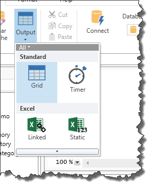

### Grid
This is the default mode. Results are displayed in a grid within the Dax Studio Results tab.

:::info
By default the results returned from a DAX query are unformatted. DAX Studio incorporates additional logic to scan through the model metadata looking for format string information which it then attempts to match up with the column names in the resultset. So if you create measures or use functions like SUMMARIZE to provide alternate names for your output columns the formatting will not flow through to the results.
:::

### Timer
In this mode the query is run, but the results are discarded. This is mainly useful for performance tuning where you want to measure the speed of two queries, but are not interested in viewing the results

### File
Results can be sent directly to a tab separated (.txt) file or to a comma separated (.csv) file.

:::info 
The query results are written to the file without formatting. Numbers are written out with their full precision and datetimes columns are written out using an ISO 8601 format. This is because this option writes text based files, so there is no facility to include metadata about the column's data type or formatting. 

Datetimes can be particularly problematic as the different regional formats mean that it can be possible to write a file on one computer that either cannot be parsed on a computer with different regional settings or in a worst case scenario you can get "corruption" where some records may get the day and month swapped without error leading to incorrect results. 

The file output is designed to work as a way of getting accurate data out of the Power BI data model. It is not designed as an alternative to building a report. If you have specific formatting requirements one option would be to copy your query to a paginated report and apply your required formatting there. Using the Excel output is another option as that file format has richer capabilities in terms of data types and formatting on top of the raw data.
:::

### Clipboard
Results will be sent to the Windows clipboard in a csv data format suitable for pasting into an application like Excel.

### Linked
When the results are output using the Linked mode a table is created in the active Excel workbook which has the connection to the tabular data source and the DAX query embedded in it. What this means is that users without Dax Studio could refresh the data in this table.

If you are running from the **Excel Add-in** you will be given a choice of which sheet in the active workbook the results will appear in.

If you are running DAX Studio outside of Excel we generate a .odc file with your selected query and this will open in a new Excel document.

:::tip
 if you get an error or do not see any results using the **Linked Excel** output trying using the **Grid** output target to test your query to make sure that it works as expected. 
:::

### Static
This output option simply executes the DAX query and copies the results into the specified sheet in the active Excel worksheet. This is just a static copy of the data which cannot be refreshed. (unlike the Linked output option)

If you are running from the **Excel Add-in** you will be given a choice of which sheet in the active workbook the results will appear in.

If you are running outside of Excel you will be prompted for a file name and a new xlsx file will be generated with one or more sheets (depending on how many queries are part of the current batch)