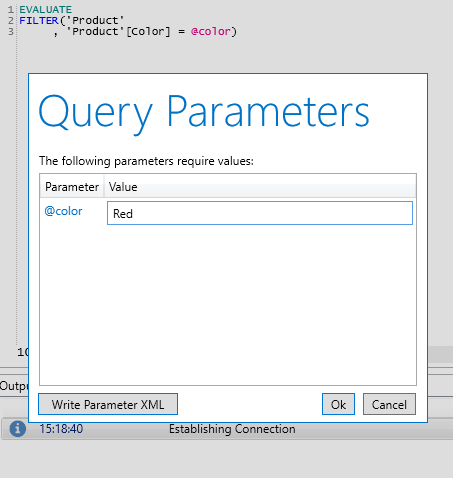
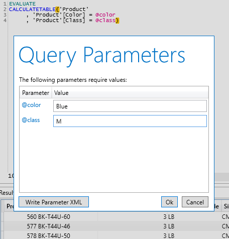
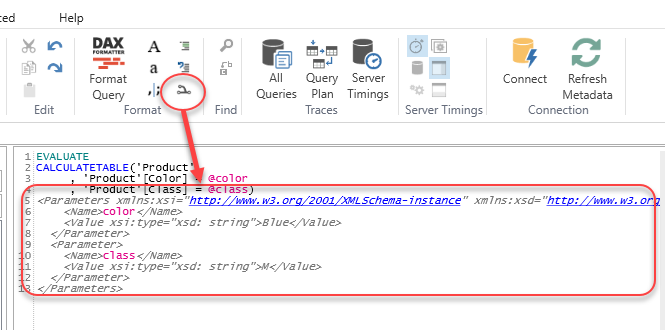

DAX Studio has a number of features that make working with parameters in DAX queries easier.

## Query Parameter Dialog
As of v2.8.0 you can now execute a query that contains parameter references directly in DAX Studio and if we find any references to parameters we will prompt for a value to use.

So if you run a query like the following in DAX Studio:

```dax
EVALUATE
FILTER('Product', 'Product'[Color] = @color)
```

You will get the following screen:



And if you have more than one parameter the dialog will generate a prompt for each unique parameter name:




## XMLA Parameter blocks

DAX Studio also supports passing parameter values to a query by using an XMLA parameter block. This can be useful in a number of scenarios. 
1. If you have a query with parameters and you want to run it a number of times with the same parameter values you can use a parameter block. 
2. You can also capture the XMLA parameter block by listening for the QueryBegin event from a SQL Profiler session while people are running parameterized DAX queries in reports from Reporting Services.

```xml
<Parameters xmlns:xsi="http://www.w3.org/2001/XMLSchema-instance" 
            xmlns:xsd="http://www.w3.org/2001/XMLSchema" 
            xmlns="urn:schemas-microsoft-com:xml-analysis">  
  <Parameter>
    <Name>PARAMETER_NAME</Name>
    <Value xsi:type="xsd: string">PARAMETER_VALUE</Value>
  </Parameter>
  
</Parameters>
```

If you click "run" on a query that has an XMLA parameter block underneath it DAX Studio will _not_ prompt you for the parameter values, but will take the values from the parameter block.


:::tip
 If you define a parameter block you need to make sure to include all of the referenced parameters as DAX Studio will not check to see that all parameters are included. Any parameters that are not given a value in the parameter block will be treated as if an empty string was passed in as the filter value.
:::

## Merge Parameters

If you don't want to use the XMLA parameter block or you need to pass the query to a tool that does not support parameters or XMLA parameter blocks you can use this button in the DAX Studio ribbon to merge the parameter block values directly into your query.

This will take a query like the following:



And merge the parameter values directly into the query:

