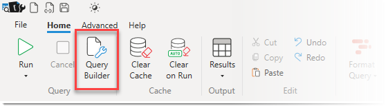
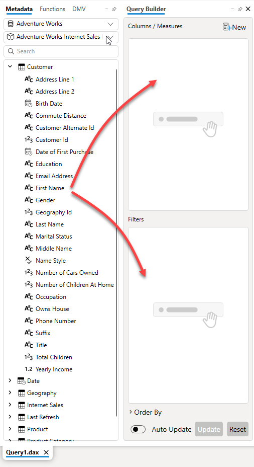
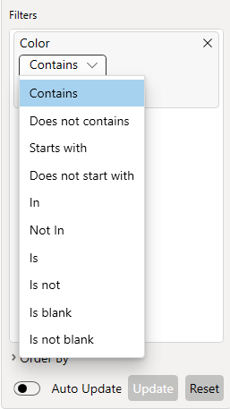
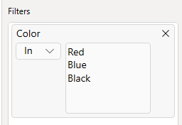
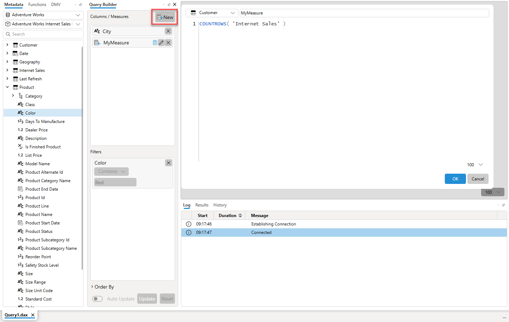
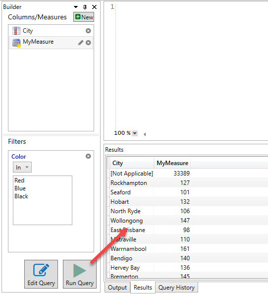
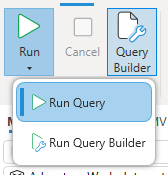
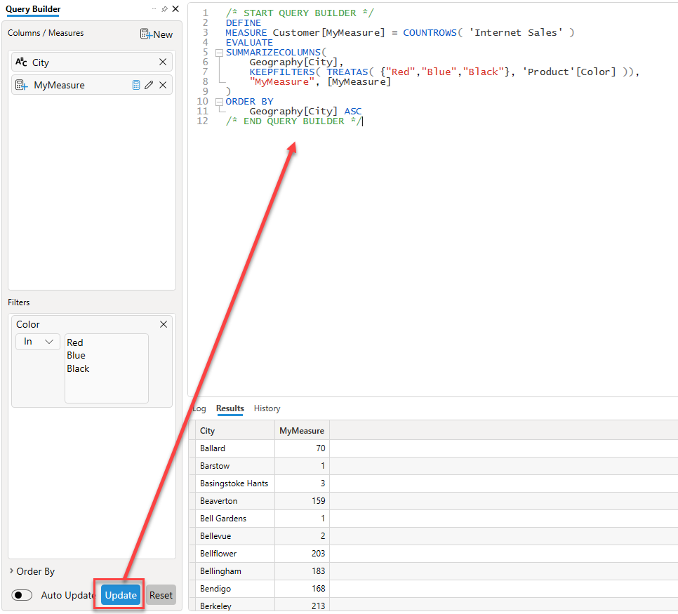

The query builder provides a drag and drop interface for building queries against your data model.

You open the query builder by clicking on the **Query Builder** button in the **Home** ribbon

Then you can drag and drop columns you want to appear in the output for your query into the top **Columns / Measures** area

And any columns you wish to use as filters you drag into the **Filters** area. There are a number of different filter operations available which may vary according to the data type of the column which you are filtering. For example you can do a *Between* filter for numbers or dates, but not for text based columns

For filters like **In** and **Not in** where you can supply a list of values you would enter each value on a new line

## Creating new Measures

Clicking the **New** button in the top right corner will open the measure editor where you can enter the name and expression for a brand new measure. The measure editor uses the same editor as the main query window so you can use the code completion feature or drag and drop objects from the metadata pane to build up your expression

## Editing Existing Measures

In addition to creating new measures you can use the pencil icon next to an existing measure to override the expression for that measure. 

:::info
 DAX Studio does not make any changes to your model, if you look at the generated query with the **Edit Query** option you will see that it is just generating a `DEFINE` block with the updated measure expression. If you want to put any of the expressions you have altered back into your data model you need to copy/paste them manually.
:::

## Running your query

Once you have constructed the query with the desired output columns and filters you can either run the query to see the results

## Run Styles

If you have both text in the edit window and selections in the Query Builder you choose whether to run the Query Builder or the text in edit window using the run style drop down.

:::info
DAX Studio attempts to automatically select the correct run mode for you based on the item you last edited. And if you either just have text in the edit window and no selections in the Query Builder or if you only have selections in the Query Builder and no text in the edit window then DAX Studio will automatically switch the run mode
:::

## Editing your query

Or you can use the **Update** button to send the generated query to the edit window where you can customize it further or copy it to another application.

If you turn on the **Auto Update** option the query builder will automatically update the text in the query window as you make changes in the query builder.

##  Keyboard Shortcuts

In addition to using the mouse to drag and drop items from the metadata pane you can use the metadata search function and the following keyboard short cuts to add items to the Query Builder.

| Hotkey |  Action |
|---|---|
| **C** _or_ &lt;Enter&gt;| add the selected item to the **Columns/Measures** area |
| **F**&nbsp;_or_&nbsp;&lt;Space&gt; | add the selected item to the **Filters** area |
| **B** | add the selected item to _both_ the **Columns/Measures** and the **Filters** areas |
| &lt;Up&nbsp;Arrow&gt; | Move up in the metadata |
| &lt;Down&nbsp;Arrow&gt; | Move down in the metadata |

