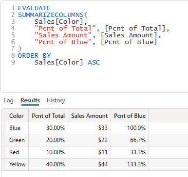
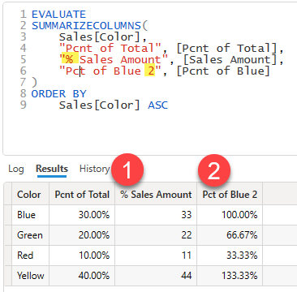

When the results of a DAX query are returned they come back in a "raw", unformatted format and it is then up to the client tool to apply any formatting. In the case of client tools like Power BI Desktop where the tool is generating the DAX query this is not hard since the tool knows exactly how to map a column in the results to the source column, but with DAX Studio it gets a lot trickier since the user can type in an arbitrary query with any structure they like.

DAX Studio uses the following logic when trying to format a column in the result grid:
1. DAX Studio attempts to match the column name in the resultset to a column or measure in the data model. If it finds a match then it will apply the format string for that column or measure.
1. Then if Automatic Formatting is enabled in the options the formatting depends on the data type of the result column:
    1. If it's a floating point column with either "%" or "pcnt" in the column name then `"#,##0.00"` format string is applied
    1. If it is an integer column the `"#,0"` format string is applied
    1. If it is a datetime column with the words "time" or "hour" the system default datetime format is used otherwise the `"yyyy-MM-dd"` format string is applied (this format can be changed in the Options)
1. Otherwise the local system's default formats are applied.

In the following Example the column names match the columns in the model and the following format strings which are defined in the data model are applied
* [Sales Amount] = `"$#,##0.00"`
* [Pcnt of Total] = `"0.00%"`
* [Pcnt of Blue] = `"0.00%"`

In the following Example the column names in the query have been edited so that they **DO NOT** all match the columns in the model and the following format strings which are defined in the data model are applied:
* [Pcnt of Total] **matches** so `"0.00%"` from the data model is applied
* [% Sales Amount] does **not** match and the column is an integer internally so the "%" does not trigger the percentage formatting and the default integer format string of `"#,0"` is applied **(1)**
* [Pct of Blue 2] does **not** match the measure name, but this is an floating point column and it does have "Pct" in the column name so the default percentage format of `"0.00%"` is applied **(2)**

:::tip
if you build your queries using the [Query Builder](../query-builder) then queries that are generated should have the correct formatting applied
:::