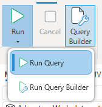

### Run Query
This is the default mode. It will execute the selected query and sent the results to the selected [output](../output-modes)

### Run Query Builder
If you have selections in the query builder this mode will generate and execute a query using the contents of the [Query Builder](../query-builder)

:::info
DAX Studio attempts to automatically select the correct run mode for you based on the item you last edited. And if you either just have text in the edit window and no selections in the Query Builder or if you only have selections in the Query Builder and no text in the edit window then DAX Studio will automatically switch the run mode
:::
