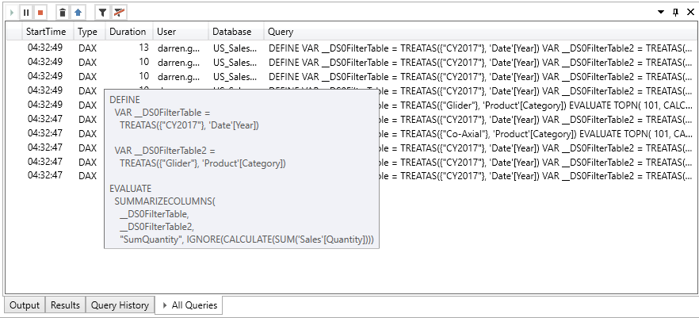
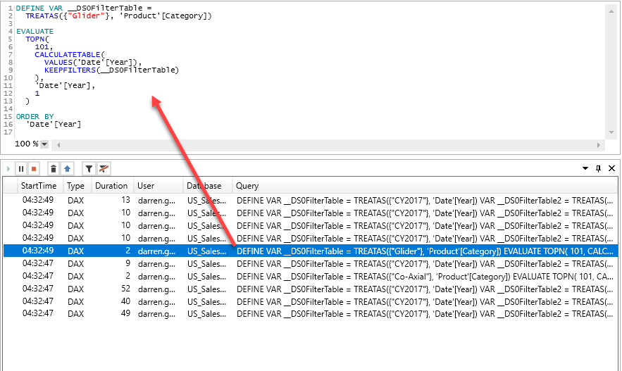
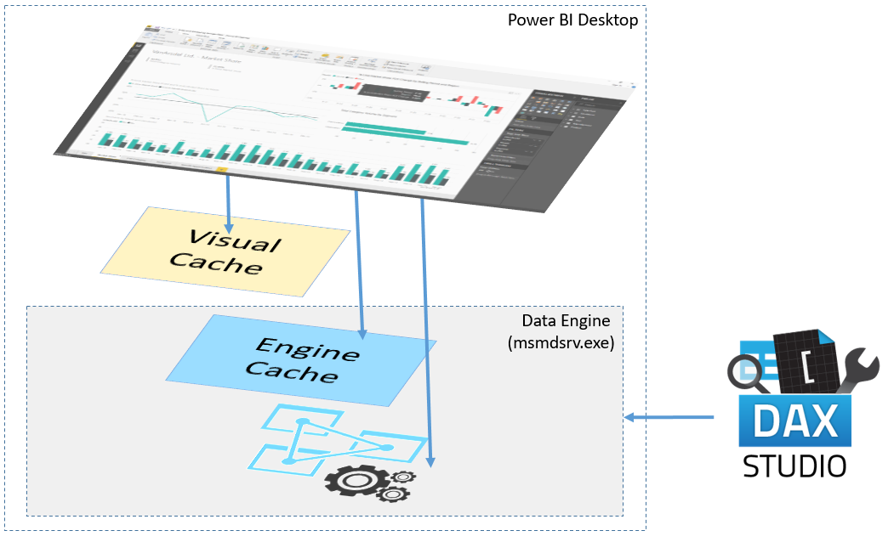

:::tip
Tracing requires server admin rights, if you do not have these the trace buttons will be disabled
:::

The All Queries trace in Dax Studio supports capturing the query events from all client tools (not just queries sent from DAX Studio like the [Query Plan](../query-plan-trace) and [Server Timings](../server-timings-trace) features do). 

The 'All Queries" trace is really useful when you wish to see the queries that are generated by a client tool like Power BI Desktop. 

The following window shows a list of queries generated by clicking on some slicers in report in Power BI Desktop.

If you find a query that you wish to examine further you can double click on the query to copy it up to the editor.

Because the All Queries trace can capture a lot of events you may find it helpful to use the filter option to help find specific queries.

At the top of the All Queries tab is a small toolbar

From left to right these buttons are as follows:

| **Button** | **Description** |
| --- | --- |
| Record | will start or resume a paused / stopped trace |
| Pause | will temporarily pause the current trace |
| Stop | will stop the current trace (the captured events will remain in the output window) |
| Delete | will clear all the captured events |
| Copy to Editor | will copy the content of the currently highlighted query to the edit pane |
| Show Filters | will show/hide the filter controls |
| Clear Filters | will clear any currently set filters |

# Power BI Desktop caching

When connecting the _All Queries_ trace to to Power BI you need to be aware that Power BI has it's own level of internal caching. At a very high level it looks something like the following:

What this means is that if a visual has already rendered before DAX Studio has connected you will normally not capture any queries unless you do something like changing a filter or crossfiltering so that you are requesting different data to that which has been stored in the _Visual_ level cache.

So the recommended procedure when attempting to performance profile the DAX queries from a Power BI report is to do the following:

1. Navigate to a blank page (or create a new blank page)
2. Save Power BI Desktop (with the blank page selected)
3. Close Power BI Desktop
4. Open the file in Power BI Desktop (there should be a blank page)
5. Connect DAX Studio to Power BI Desktop
6. Start an _All Queries_ Trace in Dax Studio
7. Switch to Power BI Desktop
8. Move to one of more of the other non-blank pages. 

At this point, DAX Studio should show you all the queries.