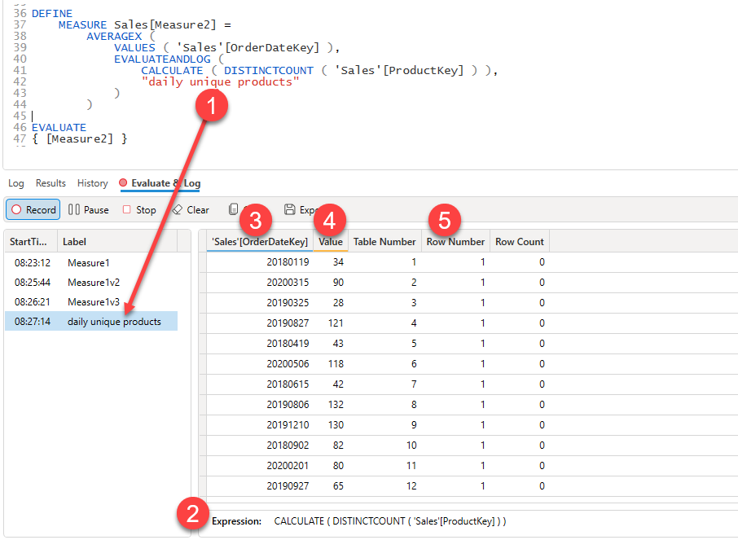

:::info
The `EVALUATEANDLOG()` function only works in models hosted in **Power BI Desktop** if a model is hosted in the Power BI service this function will not produce any output.
:::

This function is useful for viewing intermediate values and tables that are involved in evaluating DAX expressions. This trace captures the output from the [`EVALUATEANDLOG()`](https://learn.microsoft.com/en-us/dax/evaluateandlog-function-dax) function. The output of this function will show you **input** values coming from the filter context and the resulting **output** values. The output can be a scalar value or a table.

## The User Interface

1. EvaluateAndLog calls from your query are captured and displayed in the list on the left. A single query can have multiple calls to `EVALUATEANDLOG()`
2. The expression for the currently selected trace event is show here
3. Columns with a Blue underline are **input** columns generated by the current filter context
4. Columns with a Yellow underline are **output** columns
5. The remain columns are metadata columns show the table number, row number and total count of rows in the result

## Learn More

The [EvaluateAndLog tutorial](/docs/tutorials/evaluateandlog-trace) has a number of examples showing how this feature can be used to gain more insights into your query evaluations.

## Further Reading

The following series of blog articles are from one of the senior developers who built the EVALUATEANDLOG() function and are an excellent source of detailed information about this function.

* https://pbidax.wordpress.com/2022/08/16/introduce-the-dax-evaluateandlog-function/
* https://pbidax.wordpress.com/2022/08/22/understand-the-output-of-evaluateandlog-function-of-scalar-expressions/
* https://pbidax.wordpress.com/2022/08/29/understand-the-output-of-evaluateandlog-function-of-table-expressions/
* https://pbidax.wordpress.com/2022/09/06/evaluateandlog-and-dax-engine-optimizations/