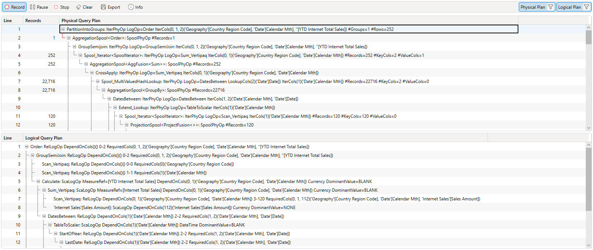
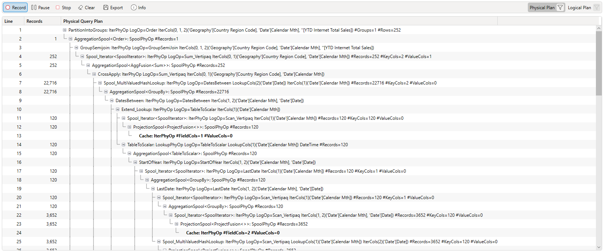
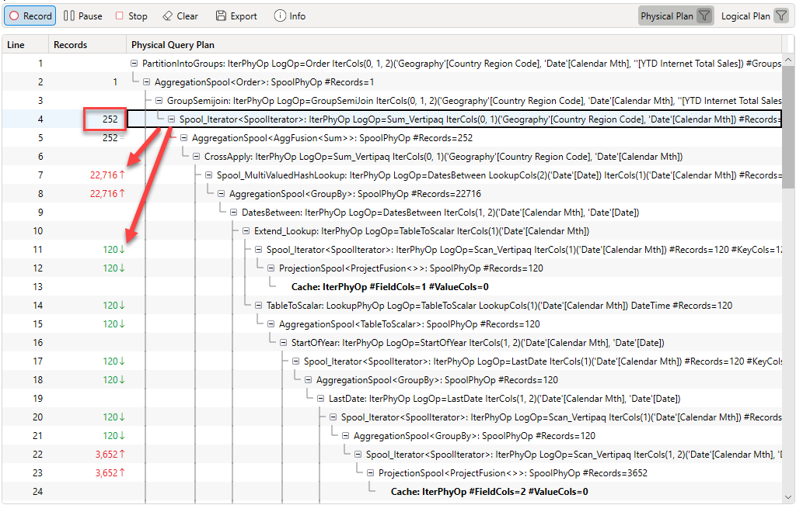
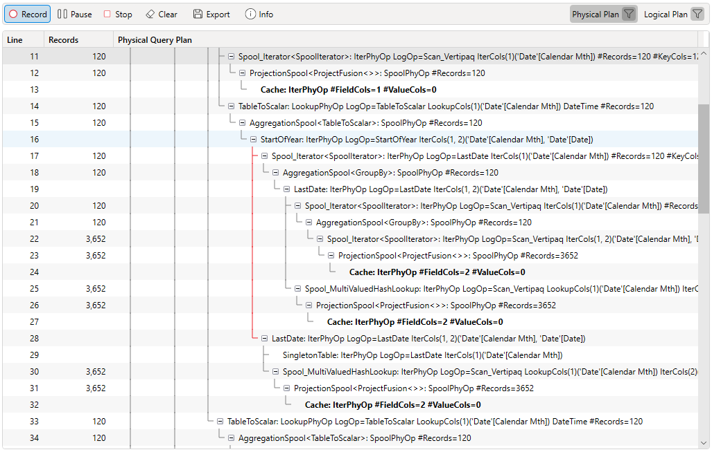
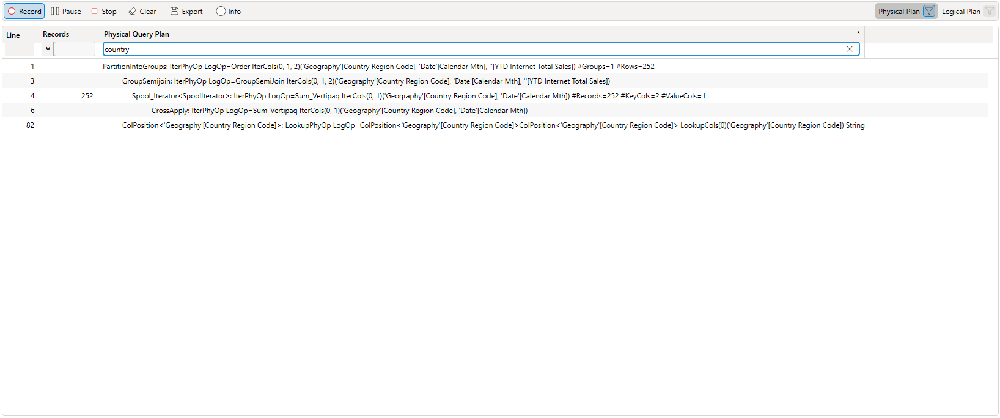
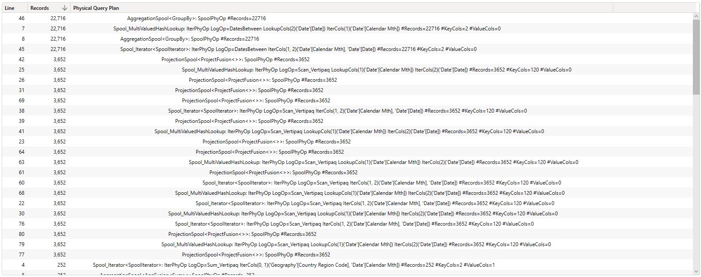
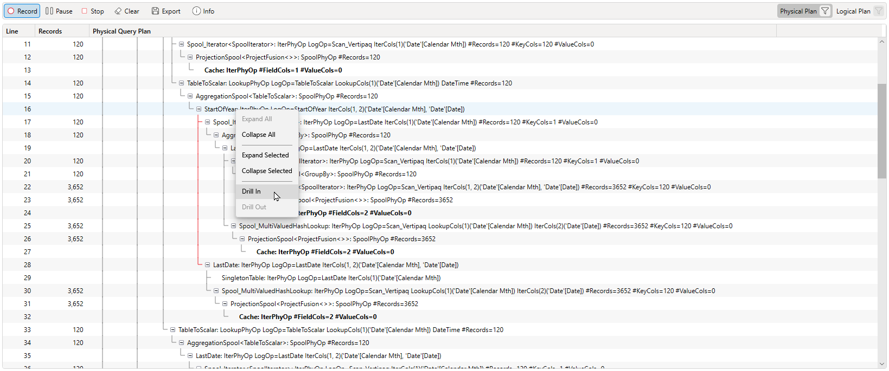
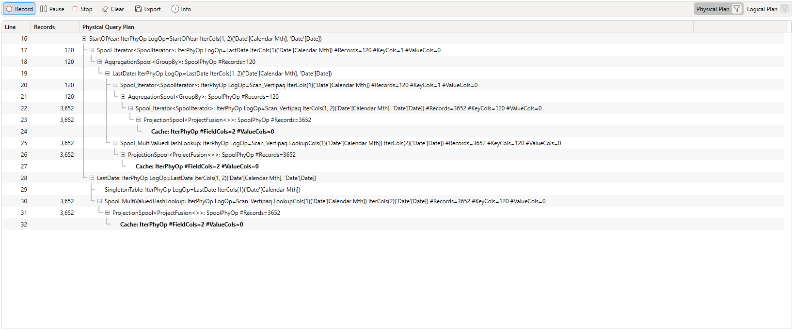
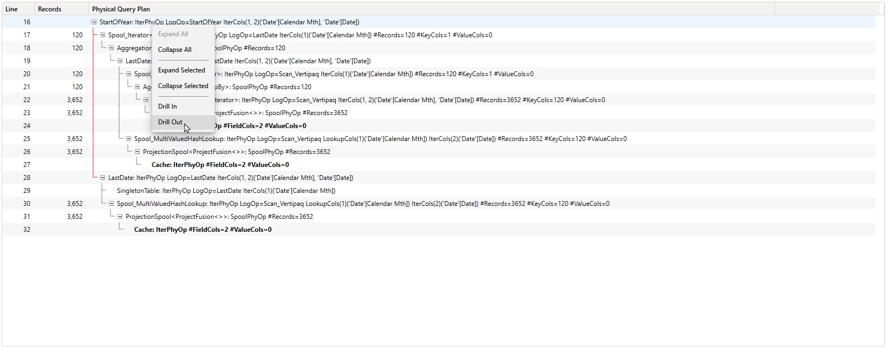

:::tip
Tracing requires server admin rights, if you do not have admin rights the trace buttons will be _disabled_
:::

:::info
It is not possible to get query plans from a Power Pivot connection.
:::

Dax Studio supports capturing the query plan trace events from a SSAS Tabular server and displaying them.

The events are displayed in a tree view that allows you to expand and collapse to help with navigating around large query plans

## Toggling Visibility
You can use the buttons in the top right to turn off one of the plans (Physical or Logical)
:::info
You cannot turn off both plans, when you toggle one of the plans off the button for the other plan becomes disabled
:::

## Descendant Rowcounts
When you click on a row in the Physical Plan that has a row count the rowcounts of any descendant items will be highlighted and will have an up/down/equals indicator. This can help you see if the particular item has a descendant operation that is iterating or filtering over a much larger dataframe.

## Descendant Line Highlighting
Clicking on a row will also highlight the descendant line for that row to ma

## Filtering
You can apply text or rowcount filters to the query plan

## Sorting
You can sort the query plan by the other columns. Note that when you do this the expand / collapse options are hidden as they no longer make sense. You can get back to the expand/collapse view by sorting on the **Line** column.

## Drill in/out
If you want to focus on a particular subset of the plan you can right click and "drill in" to that section

This will limit the display to just that row and any descedant rows. DAX Studio maintains a stack of drill-in operations so you can repeat the **Drill in** multiple times and then step back out using the **Drill out** option
:::info
The drill in/out will work regardless of the sort order. So you can do things like find an operation that runs over a large amount of rows, then drill-in, then re-sort
:::

The right-click option to drill out is enabled when you have drilled in one or more times

