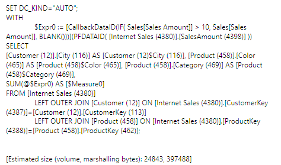
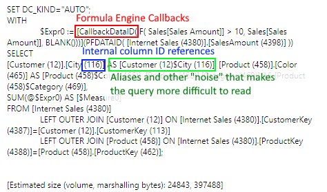

There are a number of options that control the post processing of the storage engine xmSQL text to help make it more readable.

:::info
 **xmSQL** is a "read-only" SQL-like language which exists as a textual representation of the operations that the Tabular storage engine is performing. It is not a query language that you can execute. It exists so that you can get an understanding of the operations that are being performed during storage engine scans.
:::

If you look at an example of the raw xmSQL from a storage engine event in [Server Timings](../server-timings-trace) it will look something like the following:

Raw xmSQL queries like the one above can be difficult to understand even for experienced users. However if you look closely at the query you will see a number of things.

* There are key operations like Formula Engine callbacks which blend in to other operations
* There are references to internal column IDs which make the code harder to read
* There are aliases, guids and lineage information which also make the code harder to read

By default all the server timing simplification options are enabled and the following comparison shows the difference between a raw xmSQL query and viewing that same query in DAX Studio with the default options enabled. As you can see the query on the right is much easier to read and understand.

