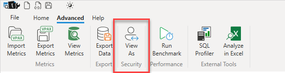
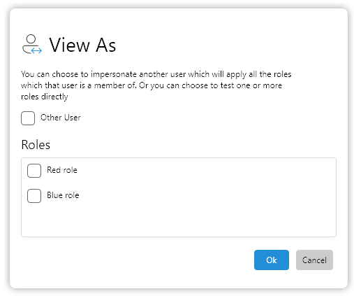
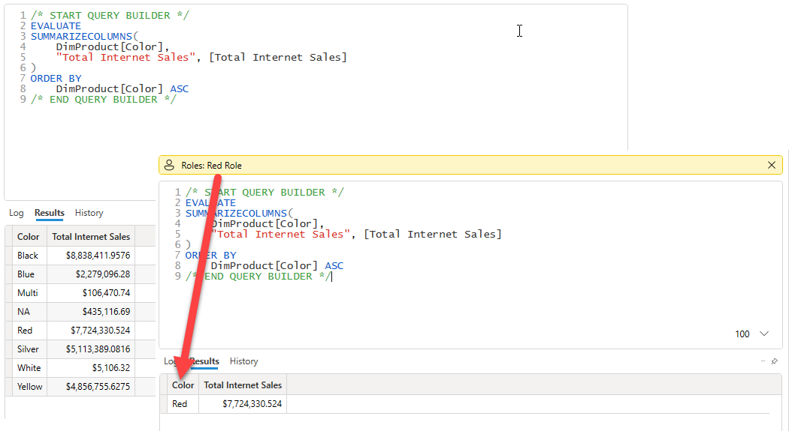
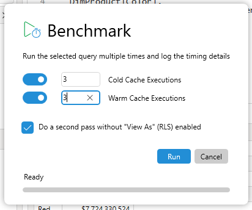
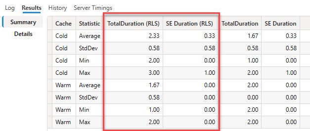

The **View As** option can be found in the **Advanced** tab and enables easy testing of RLS roles

This enables for both testing the functionality of the selected role to make sure queries return the correctly filtered data and you can run Server Timings traces to measure the impact of these roles on your queries.

The **View As** dialog will show a list of the roles in your model and you can choose which one to test

:::info
If you are testing a role with dynamic security. (ie. one that references the USERNAME() or USERPRINCIPALNAME() functions) then you need to tick the role you want to test _and_ tick the **Other User** option to impersonate a different user
:::

When it is active the **View As** option shows a yellow information bar at the top of the query editor. You can exit out of the **View As** mode by clicking on the X in the right hand side of the information bar

# Benchmarking RLS Roles

To make performance comparisons even easier a new option has been added to the Benchmark feature which is enabled when you start the benchmark while you have **View As** active.

When you tick the option to do a second pass the benchmark results will include a second set of columns in the results for those passes where the RLS role was active

