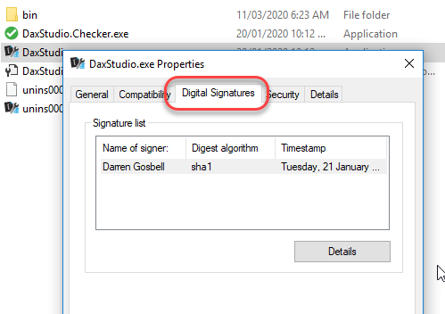
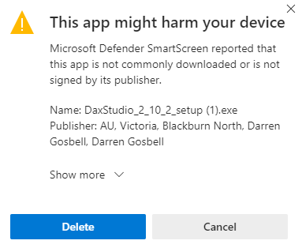
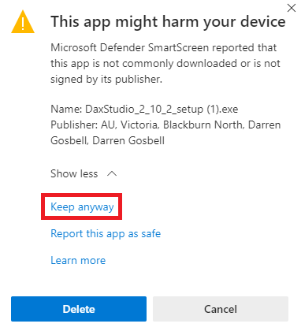
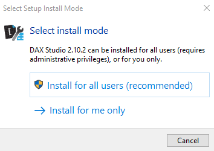

## What is SmartScreen?

:::tip
 With the release of version 2.12 the DAX Studio installer is now signed with an EV certificate kindly donated by SQLBI Corp so Windows Smart Screen should no longer falsely flag it as potentially harmful.  
:::

[SmartScreen](https://docs.microsoft.com/en-us/windows/security/threat-protection/microsoft-defender-smartscreen/microsoft-defender-smartscreen-overview) is a set of technologies from Microsoft that is designed to protect your pc from malicious software. Unfortunately for specialty products like DAX Studio, one of the criteria that Smart Screen uses to determine if a given download is safe:
* is the download is digitally signed and 
* has been "frequently dowloaded". 

The executables, Installer and Excel Add-in are all digitally signed. But apparently the level at which something is considered "frequently downloaded" is quite high. The digital certificate used for signing also expires every 12 months and when SmartScreen sees a new signature it can also take some time for it to build up trust in that new certificate.

## Digital Signature

If you right click on the installer or DaxStudio.exe in Windows Explorer and view the properties you should see a Digital Signature signed by "Darren Gosbell" (the primary developer of DAX Studio)

## Can I check DAX Studio for malicious software before downloading it?

Yes, you can right click on the download button and choose the option to "copy shortcut" (the exact wording of this my vary between the various browsers). Then go to [https://wwww.virustotal.com](https://wwww.virustotal.com) and you can submit the URL there for scanning. Virus total will the scan using a large number of AV scanners and report any issues. Typically it should report being 100% clean, but from time to time you may see a false positives often these resolve themselves within a few days. 

## Installing DAX Studio on Windows 10 with Microsoft Edge and SmartScreen Warnings

Below are the steps involved to install DAX Studio with all the Smart screen prompts.
Please note that the following steps are using Microsoft Edge to download and install DAX Studio 

Start by downloading the DAX Studio installer from the home page of the website by clicking  on the green button.

 

The following message will appear in the download bar after the downloaded completed.

|  |

To keep the download you need to click on the ellipses "…" and selected Keep

Another prompt will now appear saying that "This app might harm your device"

|  |

 To proceed you need to click on **Show more** then click on **Keep anyway** 
 
 > If you feel comfortable doing so clicking on **Report this app as safe** will help DAX Studio to build more *reputation* and this will help SmartScreen to trust our downloads faster for others

|  |

The installer is now downloaded and you can click on the exe to start the installation

You may now see another Smart Screen message saying “Windows protected your PC”

If you click on **More info** it will then show the option to **Run anyway** if you click this option the installer will now run.

The installer is now running and you can choose to installer for All Users or just for the current user. 

:::info
this prompt only appears the **first** time DAX Studio is installed. If you are upgrading the installer will use the option that you installed with the first time. So to change between All Users and Current User you need to do a full uninstall first.
:::

The install of DAX Studio should now proceed normally.

