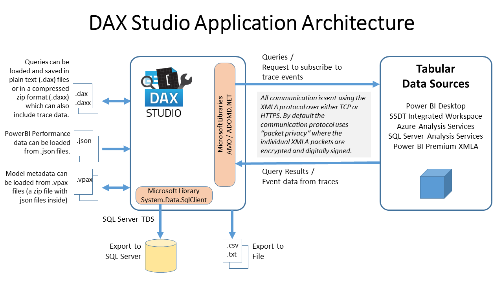

# DAX Studio - Security & Privacy

This document describes the security and privacy considerations of DAX Studio and its use. 

DAX Studio is a tool for executing DAX queries against Microsoft Tabular models. It does not store or cache any data itself, it queries the metadata from a data model when the user first connects. Then it executes queries the user defines and displays the results. 

## Analysis Services XMLA Protocol

All communication with Analysis Services instances or Power BI Premium workspaces happens through the use of the Microsoft ADOMD Client libraries and Microsoft Analysis Management Objects (AMO) client libraries. These client libraries are provided by Microsoft for redistribution in 3rd party applications such as DAX Studio. More details about these libraries can be found [here](https://docs.microsoft.com/en-us/analysis-services/client-libraries?view=asallproducts-allversions)

When DAX Studio connects to an instance of Analysis Services (local network or cloud) or a Power BI Premium workspace (cloud), this connection is performed through the client libraries mentioned above. By design, the ADOMD/AMO libraries handles the authentication and authorization of the user. All the permissions and roles are defined on the dataset itself, DAX Studio does not provide any access to data which the user could not do through other means (such as through other client tools like Excel or SQL Server Management Studio).

## Model metadata
Once the ADOMD client library establishes connection, DAX Studio will request the full CSDL metadata for the specific Analysis Services database or Power BI dataset that the user wants to connect to. This is the same metadata call that Power BI Desktop uses to populate it's metadata pane. 

DAX Studio does not collect, publish, share, transfer or otherwise make public any model metadata obtained through the ADOMD client libraries unless the user specifically initiates an action to do so (for example by saving a vpax file to a shared network location).

## Trace data

When you enable one of the Traces in DAX Studio (eg. Server Timings or Query Plans) then DAX Studio makes an additional connection to the Tabular datamodel using the AMO library and subscribes to certain detailed events from the engine. By default the data collected from these trace events is only held in local memory, but if the user saves the current session as a daxx file this information will be persisted into that file. This file will not contain data from the query results. But it is possible that some confidential information could be included in the traces. For example if you filtered on a customer name that name could be capture in the trace information. As such users should carefully review the contents of these traces before sharing them with anyone else.

## Model data content
In the following, "model data" refers to the actual data records stored within the Analysis Services database or Power BI dataset. Depending on the source database or dataset, it is very likely that the model data is confidential.

DAX Studio only allows retrieval of data through the AMOMD client library mentioned above. Regardless of which technique is used to access the data DAX Studio only stores retrieved data in local memory. DAX Studio does not collect, publish, share, transfer or otherwise make public any model data obtained through the tool. If a user chooses to copy or export query results obtained through DAX Studio, it is their responsibility to treat the copied or exported data according to the confidentiality of the data. This is no different than a user connecting to the Analysis Services database or Power BI dataset using client tools such as Excel or Power BI, in which case they will also have the option to copy query results.

In the case of using the export wizard to export a table to SQL Server DAX Studio uses the .Net System.Data.SqlClient library to connect to the specified SQL Server

## Web requests
DAX Studio may perform requests to online resources (web URLs) only in the following cases:

* **Upgrade checks**. Each time DAX Studio 3 is launched, it may perform a request to our application service, in order to determine if a newer version of DAX Studio is available. This request does not contain any data.
* **Usage telemetry**. By default, DAX Studio collects and transmits anonymous usage data. Currently this is restricted to just SessionStart and SessionEnd events. A user may opt out of sending telemetry data to us at any point.
* **Error reports** When an unexpected error occurs, we transmit the stack trace and (anonymized) error message, along with an optional description provided by the user. If a user opts out of sending telemetry data, error reports will also not be sent.
* **Using DAX formatter** A DAX expression may be formatted by clicking a button in DAX Studio. In this case, the DAX expression (and some anonymous information about the datasource version) is sent to the www.daxformatter.com webservice. 

:::info 
System administrators may choose to turn all these web requests off at install time. Or users can choose to switch off individual categories in the File > Options window.
:::

## Application Security
DAX Studio does not require any elevated privileges on the Windows machine in which it is installed, neither does it access any restricted resources on the machine. One exception from this rule, is if using the DAX Studio installer file (.exe), in which case the executable and support files required by the tool, are by default copied to the Program Files folder, which typically requires elevated permission. Both the DAX Studio binary files as well as the installer file, have been signed with a code signing certificate issued to SQL BI Inc, which is your guarantee that the code has not been tampered with by any 3rd party.

## Application data
DAX Studio stores config settings in the registry under HKEY_CURRENT_USER\SOFTWARE\DaxStudio when it is installed using the setup program.
The only exception to this is for an "All Users" install (requiring admin rights) when also the setting to block all internet access is chosen: in that case, the configuration is written to HKEY_LOCAL_MACHINE\SOFTWARE\DaxStudio (which requires admin rights to change).
The portable version that does not require an installation stores the configuration in a settings.json file created in the same folder as daxstudio.exe and any non-default settings are stored there.
