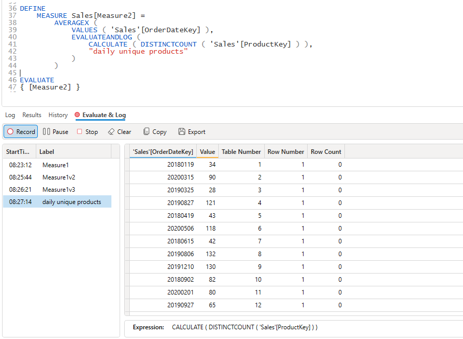

The EvaluateAndLog trace is a great tool for helping debug logic issues with DAX measures since it helps provide insights into the context of your calculations.

:::tip
The `EVALUATEANDLOG()` function is only enabled in Power BI Desktop, in order for it to work it sometimes has to disable some internal engine optimizations. DAX Studio is aware of this and will only enable the trace button when you are connected to a model hosted in Power BI Desktop 
:::

The [`EvaluateAndLog()`](https://learn.microsoft.com/en-us/dax/evaluateandlog-function-dax) function takes 3 arguments, the last 2 of which are optional using the following syntax
```
EVALUATEANDLOG(<Value>, [Label], [MaxRows])
```

Where:
* `<value>` can be any scalar or table expression
* `[Label]` is a string value which you can use to identify a specific instance of the EvaluateAndLog event, and
* `[MaxRows]` are the maxium number of rows to return (defaults to 10)

:::note
The output from the `EVALUATEANDLOG()` function can potentially get very large so the engine will truncate any results over 1 million characters
:::

## Scalar Values
The count function returns a scalar number. In this example we are just evaluating a single figure based on the count of the distinct ProductKey values in the Product table which will return a value of 397.


If we change the query slightly to return the count of product per color we can see that the data scanned by the storage engine now returns a row per color.


But notice when we introduce the `Customer[Country-Region]` column that the 


We can see this reflected in the results, the Customer table does not filter the Product table so the results for a given color are repeated for each value of Country-Region.


## Table Values



