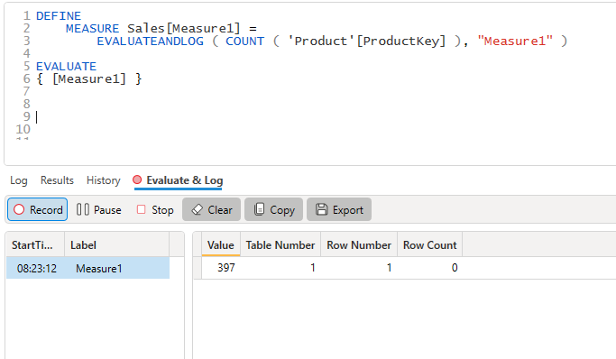

## Prerequisites

If you want to follow along and try out these queries yourself all you need is:
* DAX Studio
* Power BI Desktop
* the [Adventure Works 2020](https://aka.ms/dax-docs-sample-file) sample file

The simplest way to get started after installing both DAX Studio and Power BI Desktop is to open the **Adventure Works 2020.pbix** file, then click on External Tools and launch DAX Studio from there. 

:::tip
For more details on how you can connect to your particular data model check out the tutorial on [Getting Connected](../getting-connected/)
:::

## About the EvalauteAndLog function

The EvaluateAndLog trace is a great tool for helping debug logic issues with DAX measures since it helps provide insights into the context of your calculations.

:::info
The `EVALUATEANDLOG()` function is only enabled in Power BI Desktop, in order for it to work it sometimes has to disable some internal engine optimizations. DAX Studio is aware of this and will only enable the trace button when you are connected to a model hosted in Power BI Desktop 
:::

The `EvaluateAndLog()` function takes 3 arguments, the last 2 of which are optional using the following syntax
```
EVALUATEANDLOG(<Value>, [Label], [MaxRows])
```

Where:
* `<value>` can be any scalar or table expression
* `[Label]` is a string value which you can use to identify a specific instance of the EvaluateAndLog event, and
* `[MaxRows]` are the maxium number of rows to return (defaults to 10)

The full documentation for this function can be found on [Microsoft Learn](https://learn.microsoft.com/en-us/dax/evaluateandlog-function-dax) 

:::note
The output from the `EVALUATEANDLOG()` function can potentially get very large so the engine will truncate any results over 1 million characters
:::

## Scalar Values
The count function returns a scalar number. In this example we are just evaluating a single figure based on the count of the distinct ProductKey values in the Product table which will return a value of 397.

```
DEFINE
    MEASURE Sales[Measure1] =
        EVALUATEANDLOG ( COUNT ( 'Product'[ProductKey] ), "Measure1" )
EVALUATE
{ [Measure1] }

```



If we change the query slightly to return the count of product per color we can see that the data scanned by the storage engine now returns a row per color.

```
DEFINE
    MEASURE Sales[Measure1] =
        EVALUATEANDLOG ( COUNT ( 'Product'[ProductKey] ), "Measure1v2" )

EVALUATE
SUMMARIZECOLUMNS ( 'Product'[Color], "Measure1", [Measure1] )
```


But notice when we introduce the `Customer[Country-Region]` column that the output from `EVALUATEANDLOG()` has not changed and we still have the same intermediate results logged as before.

```
DEFINE
    MEASURE Sales[Measure1] =
        EVALUATEANDLOG ( COUNT ( 'Product'[ProductKey] ), "Measure1v3" )
EVALUATE
SUMMARIZECOLUMNS (
    'Product'[Color],
    Customer[Country-Region],
    "Measure1", [Measure1]
)
```


We can see this reflected in the results, the Customer table does not filter the Product table so the results for a given color are repeated for each value of Country-Region.


## Table Values

Up until now we've seen examples of `EVALUATEANDLOG()` producing a single output value for a single input, but it can also output tables of results.

In the following example the function is outputting all the lines from the **Sales** table for each color in the current filter context so you can see which rows are being contributing to the row count for each color.

```
DEFINE
    MEASURE sales[Measure4] =
        COUNTROWS ( EVALUATEANDLOG ( Sales, "Sales Table" ) )

EVALUATE
SUMMARIZECOLUMNS( 'Product'[color], "Measure4", [Measure4] )

```


