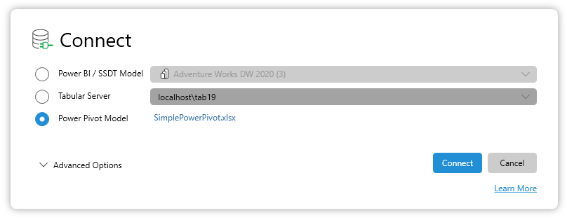
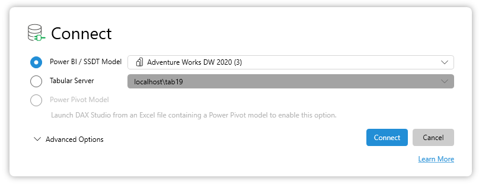
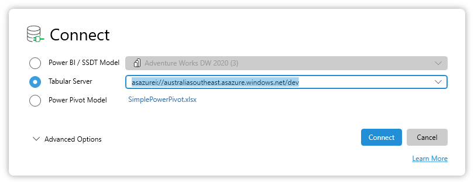
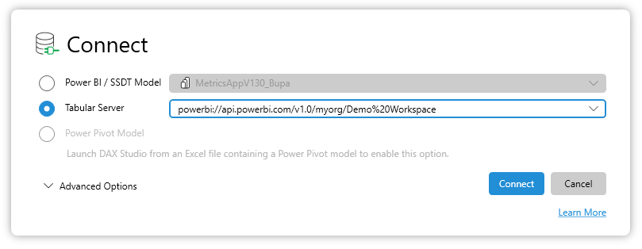

There are a number of different connection options in DAX Studio the following guide will run through all the different data sources that you can connect to.

- [PowerPivot](#powerpivot)
- [Power BI Desktop](#pbidesktop) 
- [SSDT](#ssdt)
- [Analysis Services](#ssas)
- [Azure Analysis Services](#azureas)
- [Power BI XMLA endpoint](#pbi-xmla)

## <a name="powerpivot"/>Connecting to PowerPivot in Excel

This is the only data source which has a requirement on the way in which DAX Studio is launched. In order to be able to connect to a PowerPivot data model in Excel you **must** have the DAX Studio Excel Addin installed and you **must** launch DAX Studio from the Addin ribbon in Excel. 

When you launch DAX Studio from the Excel addin and the active workbook contains a PowerPivot model you will see the following option enabled and selected by default

When you launch DAX Studio any other way the PowerPivot option will be disabled

## <a name="pbidesktop" />Connecting to Power BI Desktop

There are a couple of different ways of connecting to Power BI Desktop.

1. If you have installed DAX Studio with the default **All Users** option, the installer will register DAX Studio with Power BI Desktop as an External Tool and you should see a DAX Studio icon in the External Tools ribbon in Power BI Desktop. If you launch DAX Studio from there it will open with a connection already established to the data model in Power BI Desktop.

2. Or if you launch DAX Studio while Power BI Desktop is running you can see a list of the open pbix files in the PBI / SSDT option and connect to your file that way.

:::info
You cannot connect to reports using **Live Connections** when using option 2. When you use Option 1 the **External Tools** option knows about the Live Connection and sends through the connection details for the underlying Live Connection.
:::

## <a name="ssdt" />Connecting to SSDT (SQL Server Developer Tools)

The SSDT option works if you are using the internal workspace option. In this scenario SSDT is similar to Power BI Desktop in that it launches a private version of the tabular engine in the background which we can then connect to. The only main difference between SSDT and Power BI Desktop is that we can only "see" the solution name, not the project name. So if you have multiple tabular models in a single solution you will see multiple entries with the same name, one for each project in the solution. 

## <a name="ssas" />Connecting to Analysis Services

To connect to an Analysis Services instance you just need to enter the instance name in the server option in the connection dialog

## <a name="azureas" />Connecting to Azure Analysis Services

To connect to Azure Analysis Services you enter the name of your instance in the server option in the connection dialog. This typically is a string starting with `asazure://`

## <a name="pbi-xmla" />Connecting to Power BI Premium XMLA Endpoint

To connect to Power BI Premium XMLA endpoints you enter the name of your instance in the server option in the connection dialog. This typically is a string starting with `powerbi://` and you can typically copy this string from the Premium tab in the Workspace settings. Or from the settings in a given dataset.

