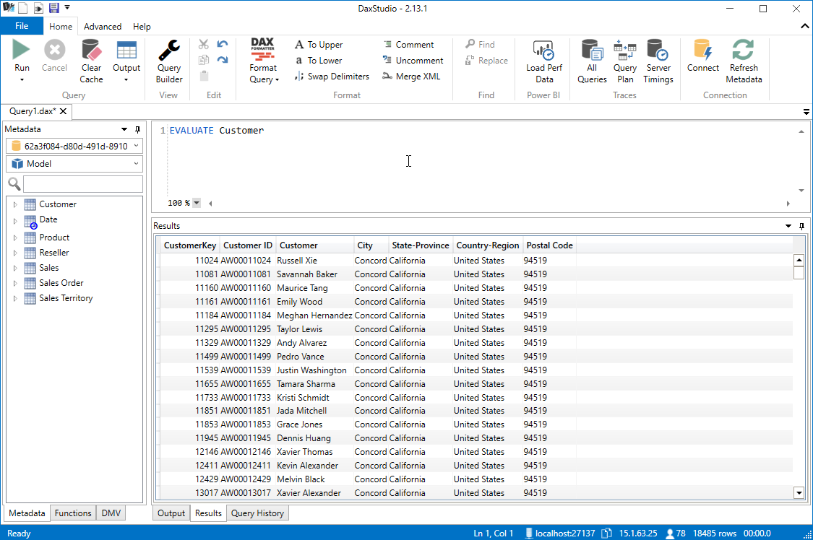
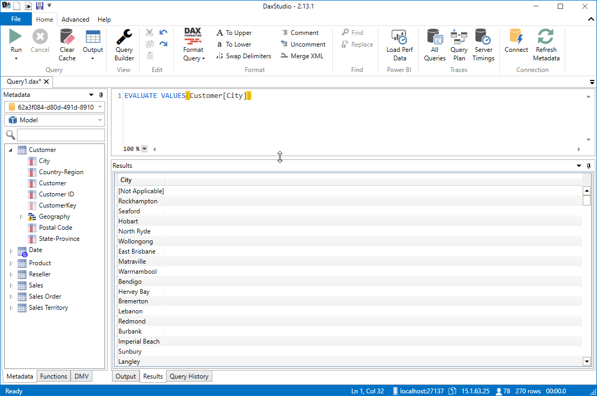
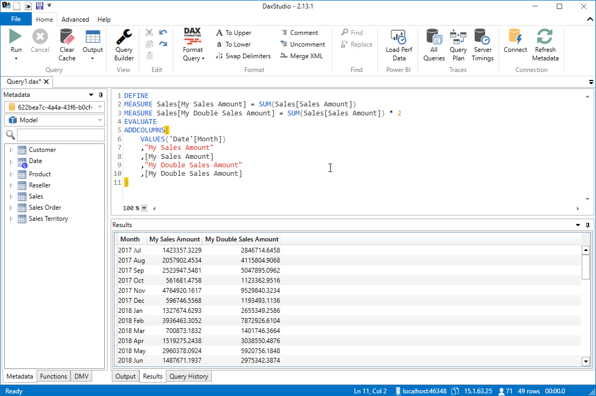
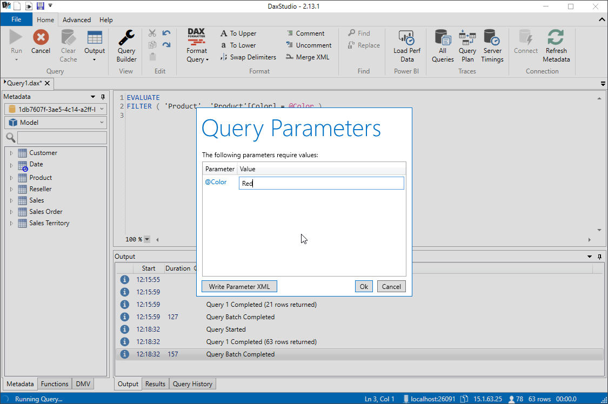

DAX Queries have quite a simple structure. Microsoft describes the query syntax in their documentation [here](https://docs.microsoft.com/en-us/dax/dax-queries). But in this guide we are going to take a very practical, example based approach. 

If you want to follow along and try out these queries yourself all you need is:
* DAX Studio
* Power BI Desktop
* the [Adventure Works 2020](https://aka.ms/dax-docs-sample-file) sample file

The simplest way to get started after installing both DAX Studio and Power BI Desktop is to open the **Adventure Works 2020.pbix** file, then click on External Tools and launch DAX Studio from there. 

:::tip
For more details on how you can connect to your particular data model check out the tutorial on [Getting Connected](../getting-connected/)
:::

## Basic Queries

The simplest form of DAX query is `EVALUATE <table expression>` 

So you can run `EVALUATE Customer` to output all the rows in the customer table



But you don't just have to use a table name, you can use any function that returns a table. To get a distinct list of all the values in a column you can use the [VALUES](https://dax.guide/values) function which returns a table with a single row with all the unique values from the specified column.

```
EVALUATE
VALUES ( Customer[City] )
```



Or if you don't want every row in the table you could use the [CALCULATETABLE](https://dax.guide/calculatetable) function to only return rows that meet a given criteria.

```
EVALUATE
CALCULATETABLE ( Customer, Customer[City] = "Redmond" )
```

You can even combine the [VALUES](https://dax.guide/values) and [CALCULATETABLE](https://dax.guide/calculatetable) functions to get a list of all Cities that have a first character of "R"

```
EVALUATE
CALCULATETABLE ( VALUES ( Customer[City] ), LEFT ( Customer[City], 1 ) = "R" )
```

## Sorting Results

If we continue on with the previous example you will see that the results come back in a random order. If we want our query to sort the results we can add an optional `ORDER BY` clause to the end of the query. So if we wanted to sort the results by the city name we would do the following:

```
EVALUATE
CALCULATETABLE ( VALUES ( Customer[City] ), LEFT ( Customer[City], 1 ) = "R" )
ORDER BY Customer[City]
```

> **NOTE:** Some client tools (like Power BI Desktop) will generate an `ORDER BY` clause for you based on the properties set in your data model


## Adding Calculations

To add a calculation to your query like measures and variables you would use the optional `DEFINE` keyword at the start of your query

To define a new measure in your query which sums the value of the existing `Sales[Sales Amount]` column you would write the following:

```
DEFINE
    MEASURE Sales[My Sales Amount] =
        SUM ( Sales[Sales Amount] )
EVALUATE
ADDCOLUMNS ( VALUES ( 'Date'[Month] ), "My Sales Amount", [My Sales Amount] )
```

To define multiple measures you can add multiple blocks of `MEASURE <table>[<measure name>] = <expression>`

```
DEFINE
    MEASURE Sales[My Sales Amount] =
        SUM ( Sales[Sales Amount] )
    MEASURE Sales[My Double Sales Amount] =
        SUM ( Sales[Sales Amount] ) * 2
EVALUATE
ADDCOLUMNS (
    VALUES ( 'Date'[Month] ),
    "My Sales Amount", [My Sales Amount],
    "My Double Sales Amount", [My Double Sales Amount]
)
```




## Returning a single value

Sometimes you may just want to return the result of a measure. But measures return a single scalar value not a table, so if you try to write the following it will produce a syntax error

```
EVALUATE
SUM ( Sales[Sales Amount] )
```

We can fix this by using the table constructor syntax and wrapping the measure in curly braces `{ }`

```
EVALUATE
{ SUM ( Sales[Sales Amount] ) }
```

For older versions of the tabular engine which do not support the table constructor syntax we can use the [ROW](https://dax.guide/row) function

```
EVALUATE
ROW ( "Sales Amount", [Sales Amount] )
```


You can also mix this with the `DEFINE` clause to create a measure expression and then return a single value

```
DEFINE
    MEASURE Sales[Total Sales] =
        SUM ( Sales[Sales Amount] )
EVALUATE
{ [Total Sales] }
```

## Selecting columns from multiple tables

The easiest way to generate a query using columns from multiple tables is to use the [SUMMARIZECOLUMNS](https://dax.guide/summarizecolumns) function. This function takes a list of columns, followed by an optional list of table expressions to use as filters, followed by an optional list of measures/expressions.

> **NOTE:** It is _**strongly**_ recommended to always use a measure or expression of some sort with the `SUMMARIZECOLUMNS` function if you don't do this the function will generate a large crossjoin of all possible combinations of every value in the specified columns which is not normally useful

```
EVALUATE
SUMMARIZECOLUMNS (
    Product[Color],
    Reseller[Business Type],
    FILTER ( ALL ( 'Product'[List Price] ), 'Product'[List Price] > 150.00 ),
    TREATAS ( { "Accessories", "Bikes" }, 'Product'[Category] ),
    "Total Sales", SUM ( Sales[Sales Amount] )
)
```

## Multiple Resultsets

DAX queries also allow for the return of multiple recordsets within a given batch

So you can execute the following: 

```
EVALUATE
Customer
EVALUATE
'Product'
```


And you will get 2 tabs returned in DAX Studio, one with the contents of the **Customer** table and the other with the contents of the **Product** table.

But note that within a single batch, although you can have multiple `EVALUATE` statements you can only have a single `DEFINE` statement. So you would need to declare all your calculations in that one block.

```
DEFINE
    MEASURE Sales[Total Sales] =
        SUM ( Sales[Sales Amount] )
    MEASURE Sales[Total Cost] =
        SUMX ( Sales, Sales[Unit Price] * Sales[Order Quantity] )
EVALUATE
{ [Total Sales] }
EVALUATE
{ [Total Cost] }
```


## Using Parameters in Queries

One of the unique features that DAX Studio has is the [support for parameterized queries](/docs/features/parameter-support/)

To add a parameter to a DAX query you can start with a query that includes a filter such as the following:

```
EVALUATE
FILTER ( 'Product', 'Product'[Color] = "Red" )
```

And then replace the reference to `"Red"` with a parameter called `@Color` 

```
EVALUATE
FILTER ( 'Product', 'Product'[Color] = @Color )
```

When you execute a query with a parameter, DAX Studio will prompt you for the parameter to use



