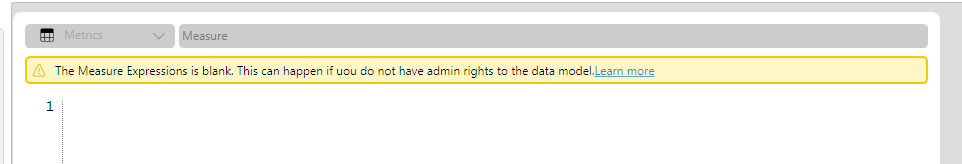

# Blank Measure Expressions

If you see the following warning when editing a measure in the query builder it means that DAX Studio was unable to access the expression for the measure. 

The most common cause for this is that you do not have admin rights on the data model. This is a permissions issue and there is no way to bypass this to get access to the expression. 

You can still type in your own measure expression to override the one in the datamodel for you current query or you can cancel out of the edit dialog and your query will still run using the expression in the data model.